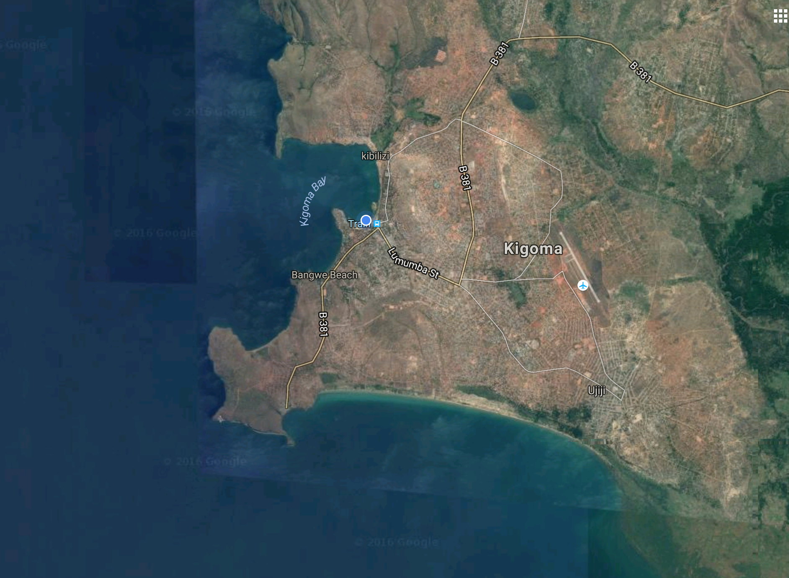

---
output:
  html_document:
    css: perrycustom.css

---
         
    
## The CLEAT Project - Funded by DANIDA and a collaboration between Aarhus University, TAFIRI, Illinois State University, and University of Dar es Salaam.         

The site will provide details and photos of the launch of the buoy on Lake Tanganyika. 

We are located at TAFIRI in Kigoma, Tanzania
 

 
*Kigoma Tanzania*

## November 29         
### Day 1 - The unpacking of the shipping container          
[Day 1](buoy/day1/buoy_day1.html)         

## November 30          
### Day 2 - Big Science - Cranes, Trucks, and Ships          
[Day 2](buoy/day2/buoy_day2.html)         

##December 1          
### Day 3 - Data loggers, anchors, and GPS surveys          
[Day 3](buoy/day3/buoy_day3.html)         

##December 2          
### Day 4 - Anchors away -          
[Day 4](buoy/day4/buoy_day4.html)      

## December 3
### Day 5 - THe last anchor goes in today - Stay tuned for updates.

