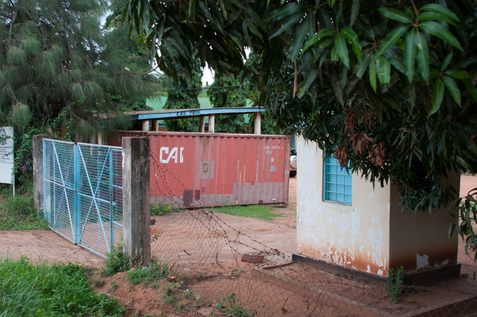
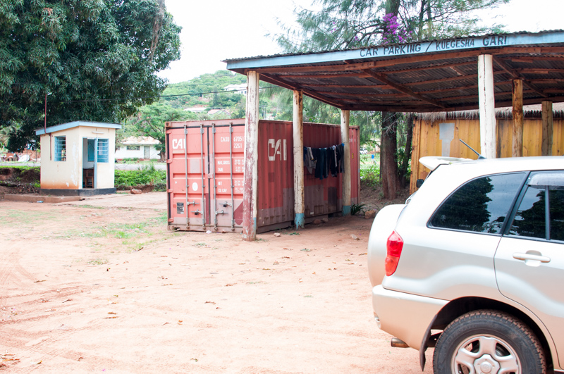
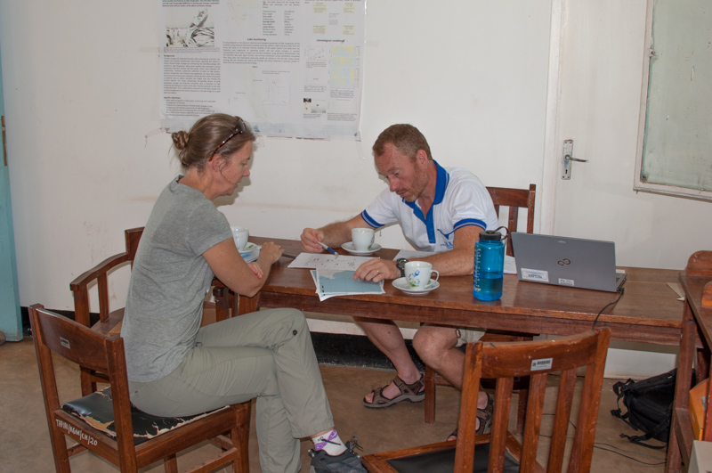
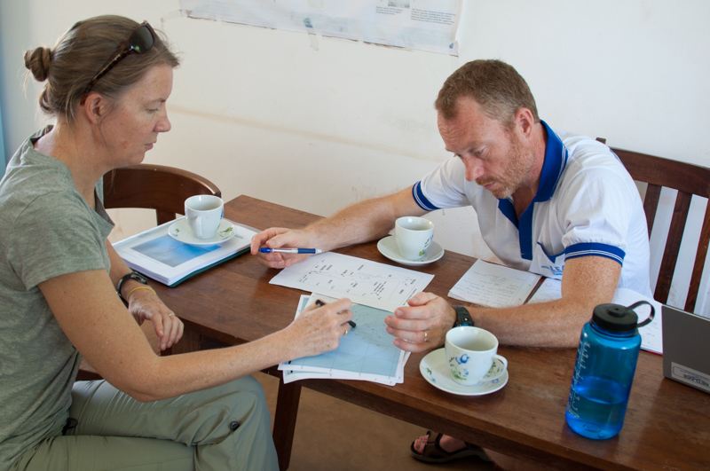
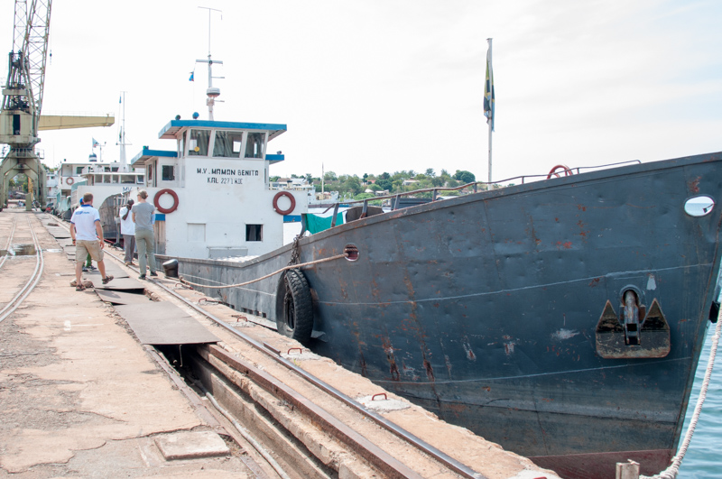
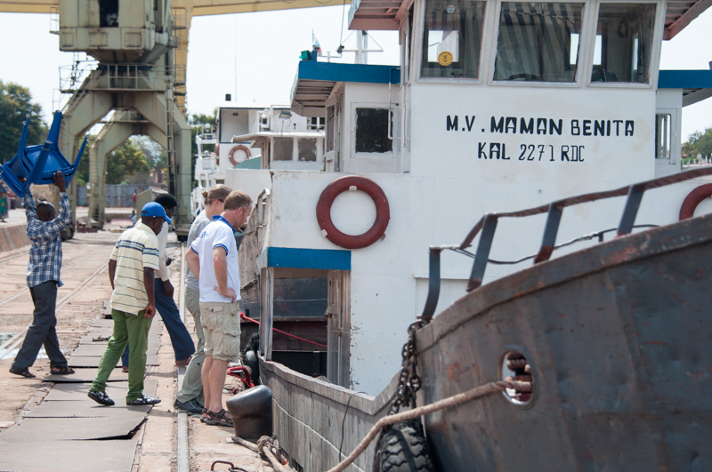
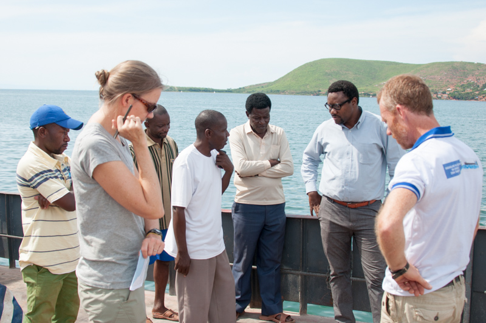
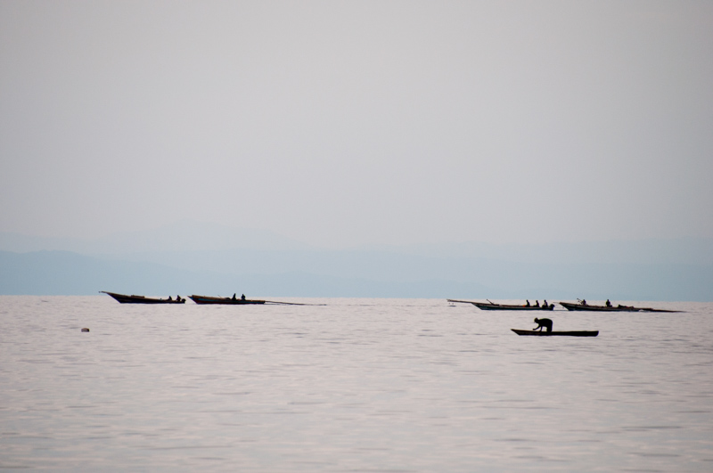
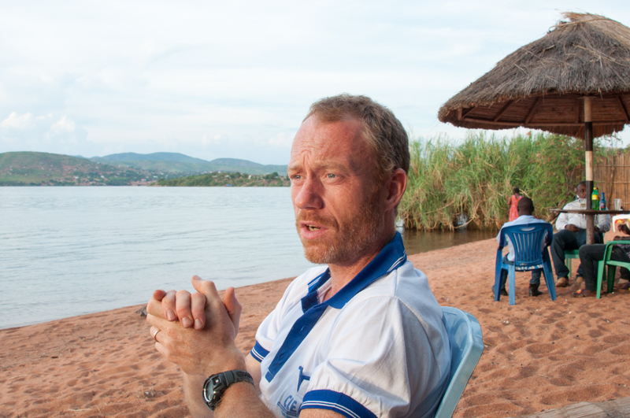

---
output:
  html_document:
    css: perrycustom.css
---
## 29 November - Day 1 - It Begins

 

 
Waiting for the second flight to Kigoma at 3AM. 
 

 
The Shipping container with the buoy in it behind barb wired fences and a guard at TAFIRI.
 

 
A car to give perspective.
 

 
The datalogger - trying to get it charged and ready.
 

 
Planning and organizing buoy location.
 

 
Planning and organizing buoy location.
 

 
Working with Ishmael on how to do the deployment

 
 

 
We managed to get the 400 Kg Buoys out of the container.

 

 
Buoy 1 is called CLEAT 01

 

 
We are looking at the Maman Benita - the ship that will carry the buoy and anchors to the site.

 

 
We are looking at the Maman Benita - the ship that will carry the buoy and anchors to the site.

 

 

We are talking to the captain and crew of the Maman Benita.

 

 

The real African Queen

 

 

Fishermen on their way out to fish for the night

 

 

 

 
Peter is saying his prayers and is very confident.

 

 
Catherine always optimistic

