---
output:
  html_document:
    css: perrycustom.css
---
## 30 November - Day 2 - Big Scinece - Cranes, Trucks and Ships.
 
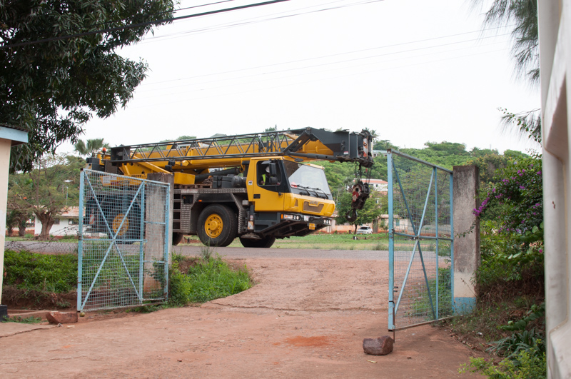
 
It begins with the arrival of the crane. 

 
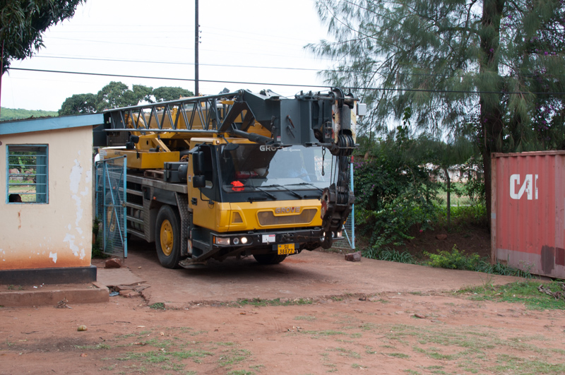
 
Thats not going to fit... The crane is bigger than we expceted but a great driver and worker do a wonderful job

 
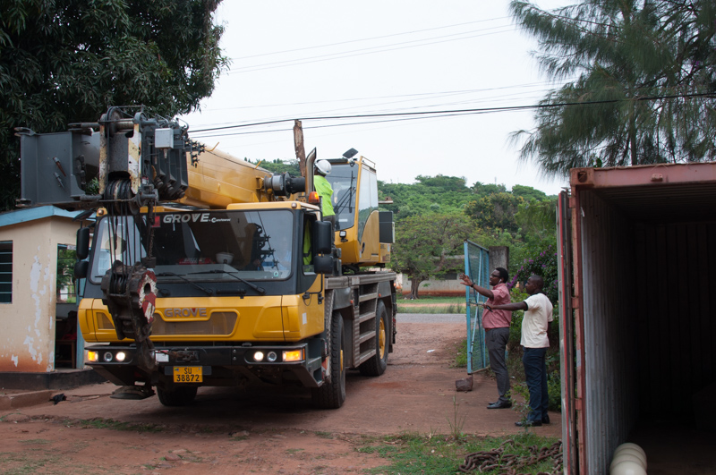
 
Crane limbo - tryng to get the crane in under the electical wires.
   

### The stuff that needs to go into the truck.
 
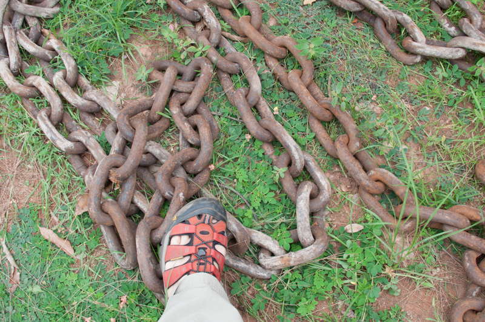
 
The chain which is 10m long and takes 2 people to drag one of them around. 

 
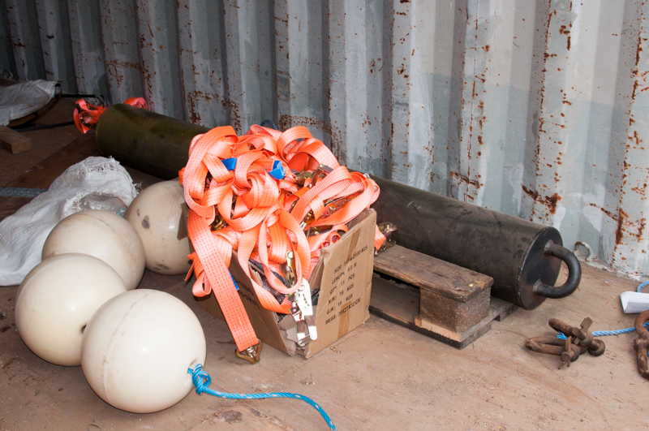
 
The floats to attach to the anchor line to help hold it up and absorb the shock of the waves. In the back is the counter weight.

 
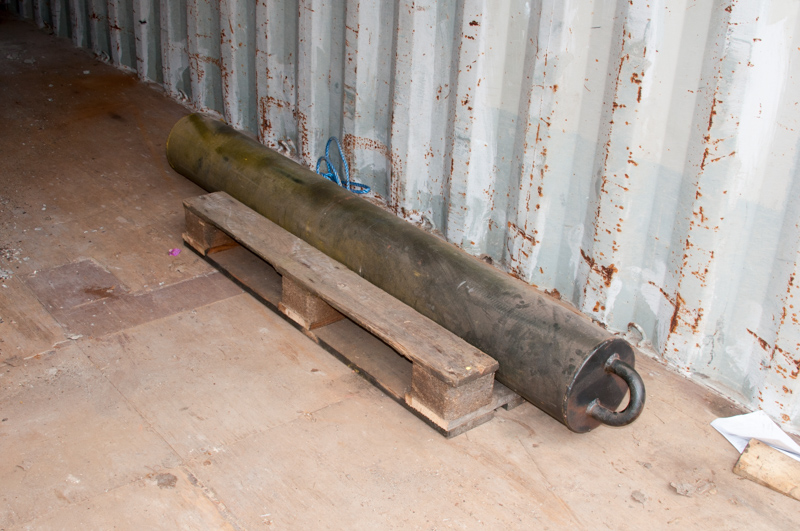
 
Also, the buoy counter weight which does not look like much but is 400kg.

 
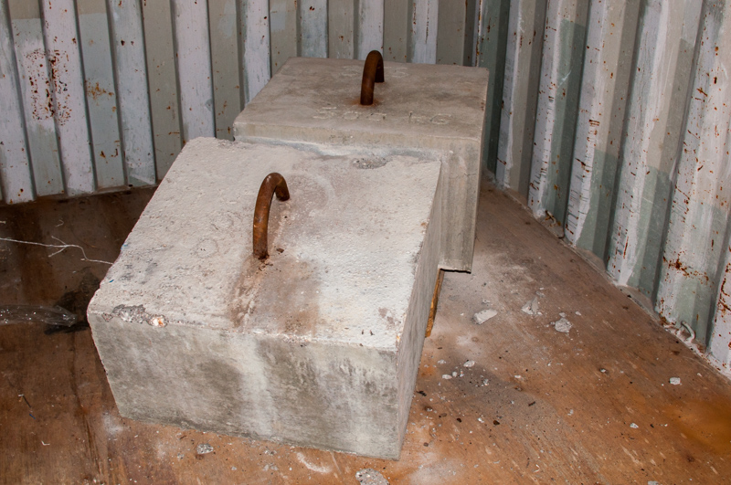
 
The two anchors at the back of the shipping container that each weight 500kg. These will be dropped in with each with the 10m of chain in 400m of water in Lake Tanganyika.

 
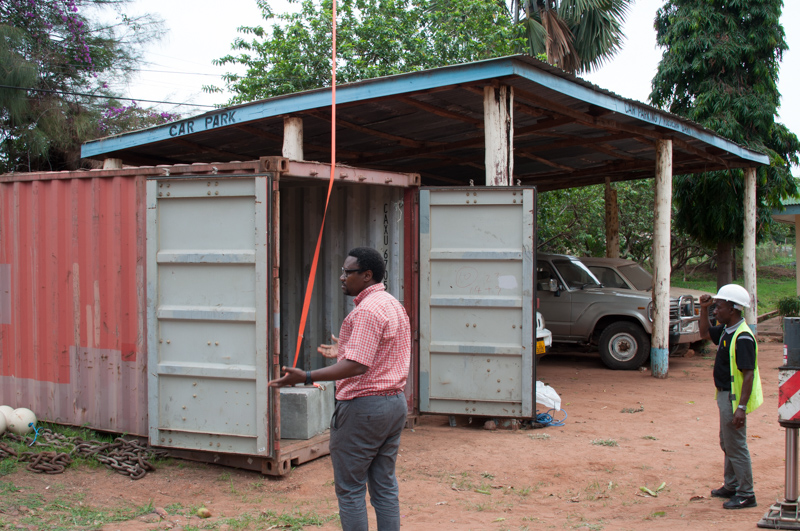
 
One of the anchors being pulled out with the pink straps that came in the shipping container. 

 
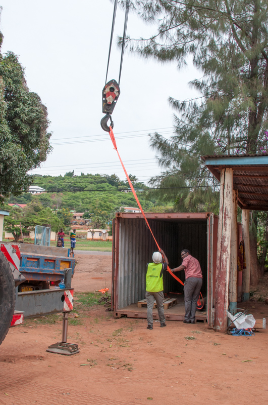
 
The anchor emerges. 

 
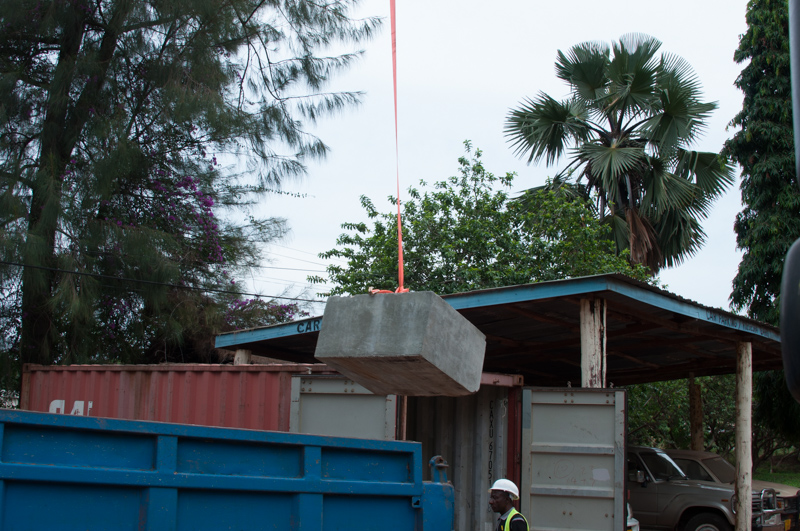
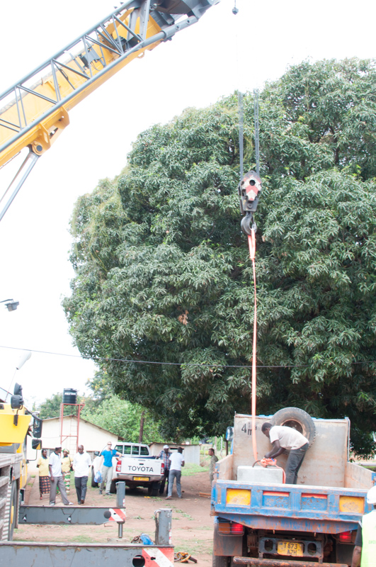
 
Lowering the anchors into the truck. The straps held and so did the knots.

 
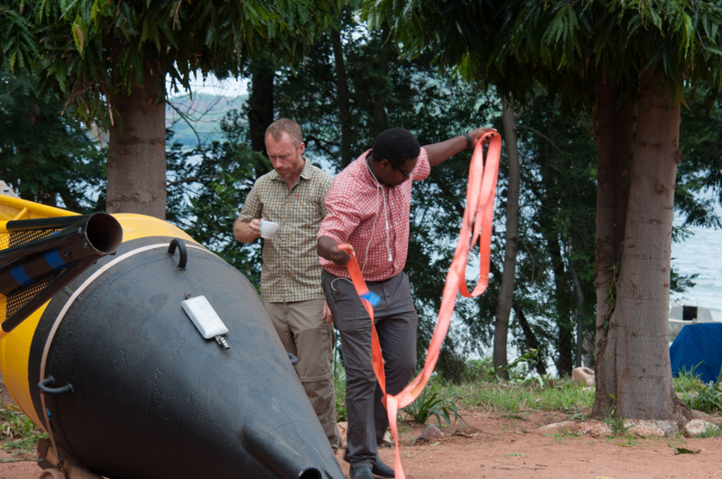
 
Time to move the 400kg buoy that is longer than the truck we have.

 

 
Peter looking where the buoy will go.

 
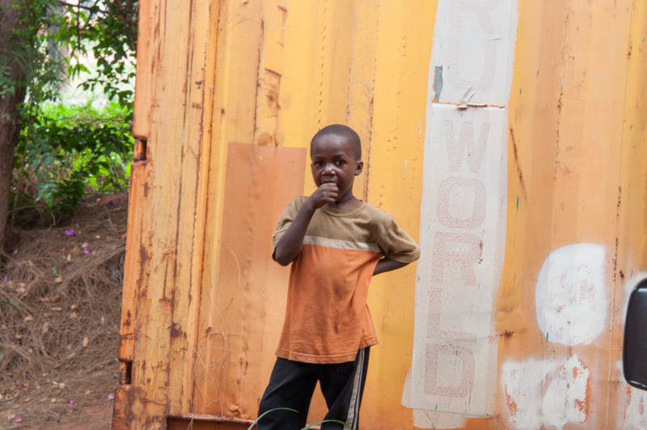
 
The goal of this project is to develop future Tanzanian scientists and this one was very interested in our work. We hope he stops by more. His friends were a bit more shy.

 
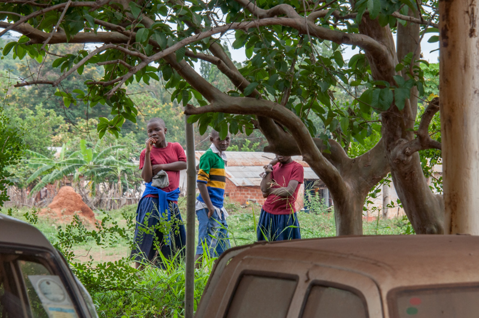
 
Again, they were a bit more shy but were very interested. This is the future of science in Tanzania.

 
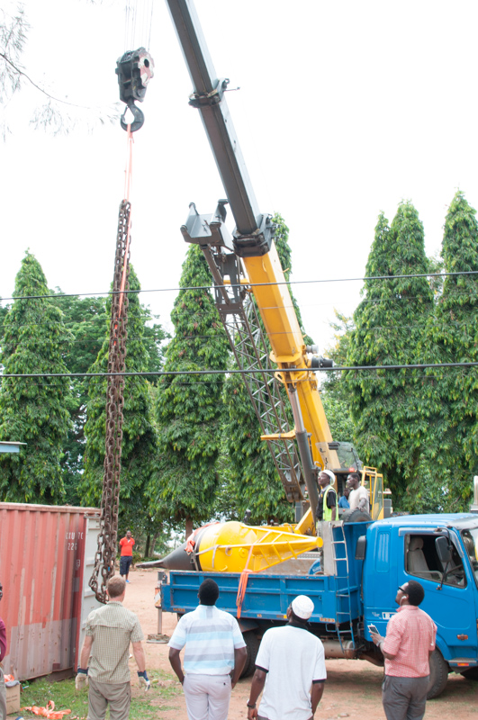
 
The chain goes in the truck.

 
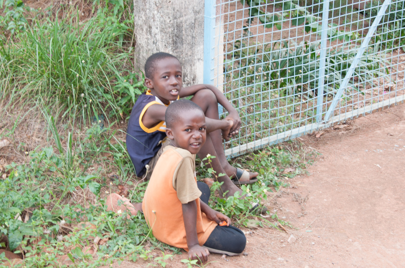
 
The little scientist brought a collaborator.

 
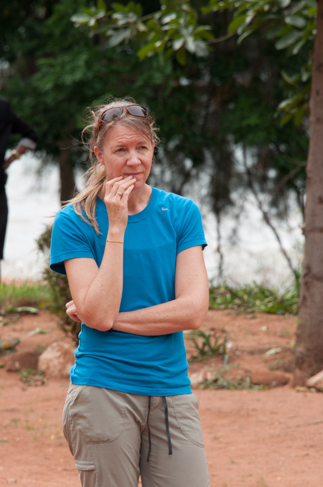
 
We were all a bit tense on the loading of the materials.

 
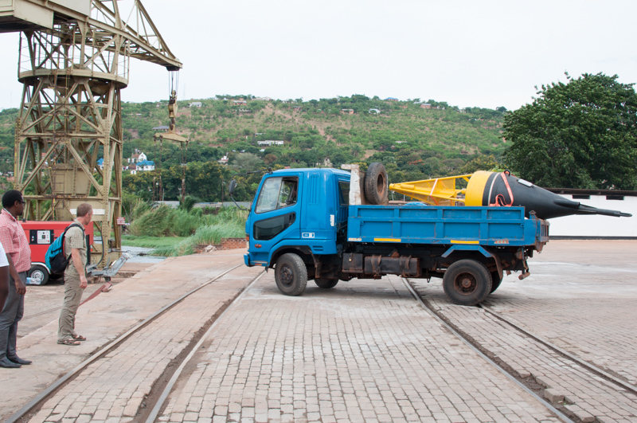
 
The truck arraives at the harbor.

 
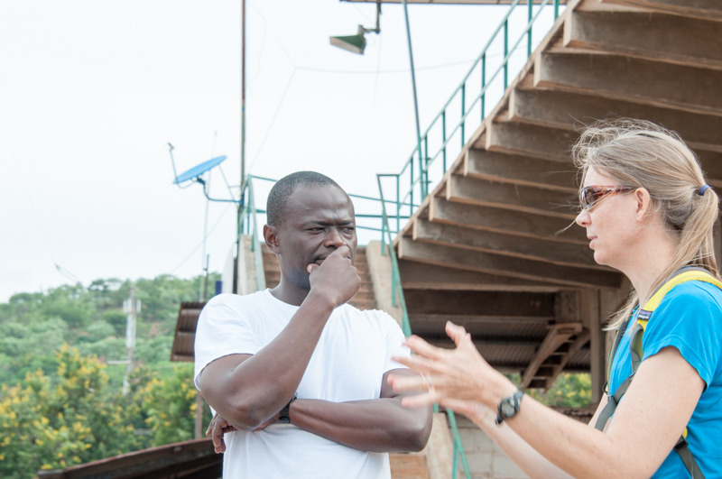
 
Huruma and Catherine talk about some of the details of the buoy.

 
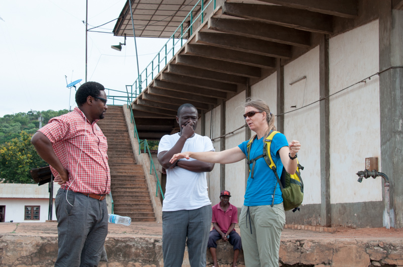
 
Ishmael, Huruma and Catherine talk about some of the details of the buoy.

## MORE TO COME - OFF TO THE HARBOR TO FLOAT THE BUOY

