---
output:
  html_document:
    css: perrycustom.css
---
## 1 December - Day 3 - A rainy day to get the anchors, datalogger and sensors, and survey the site for launching

 
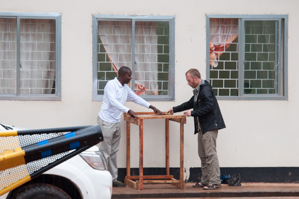
 
The rain doesn't stop us - time to build the holder for the spool of cable.

 
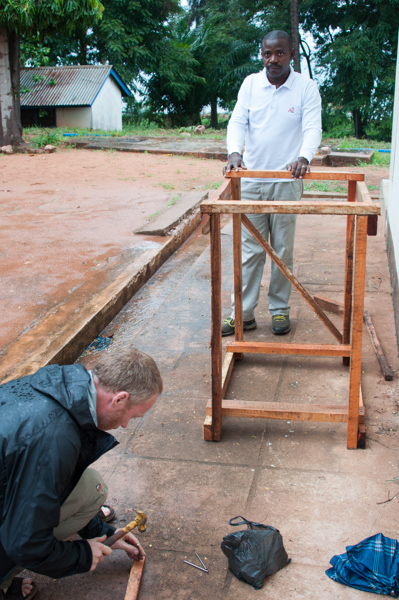
 

 
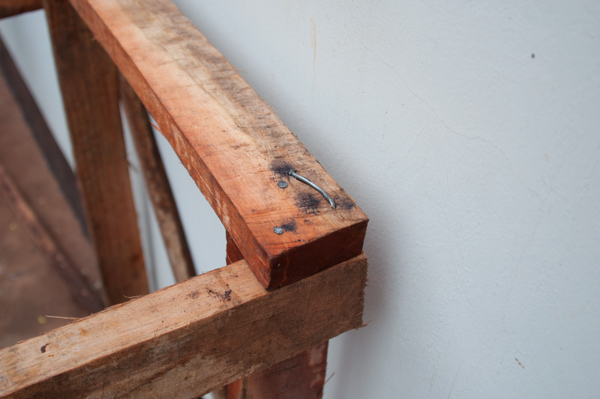
 

Carpentry at its best - well the wood was hard

 
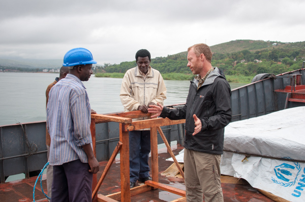
 

I don't think the engineer is buying this - discussions and planning help get us to the point where we will go out Friday to deploy.

 

 

The cook getting more dinner for the crew. Unlike most fishermen he said it was great and was catching many fish.

 
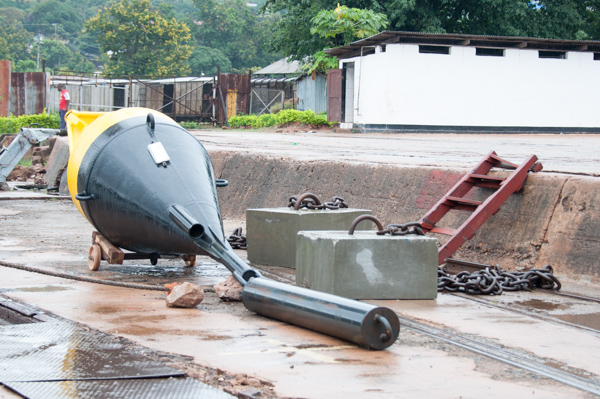
 

The buoy ready to put in the water with its counter weight.

 
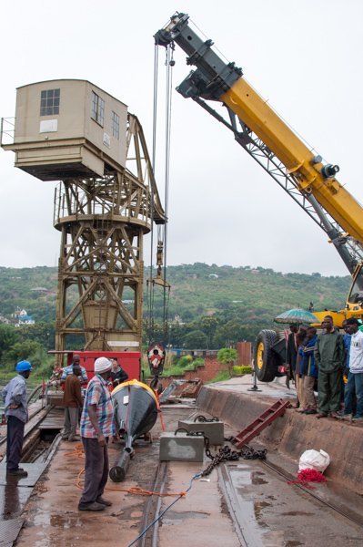
 

This was a big deal in the port and a lot of people showed up.

 
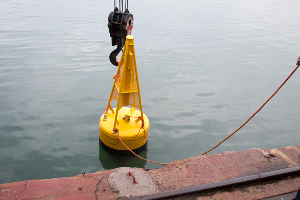
 

This buoy is actually going  into the water now.... Thank you Danish Marine Authority for donating the buoy!

 
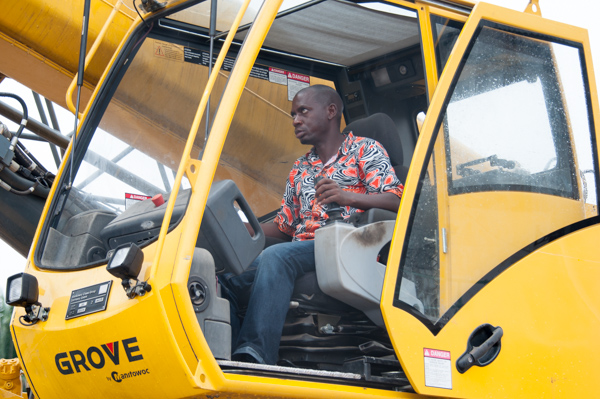
 

The patient and skilled crane operator.

 
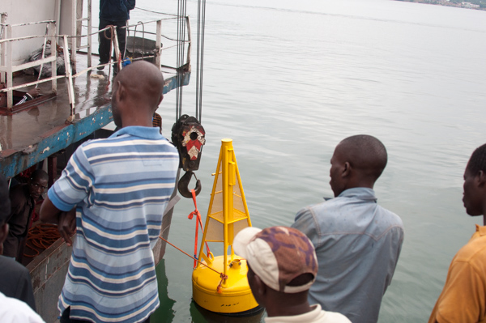
 

*IT'S IN THE WATER*

 
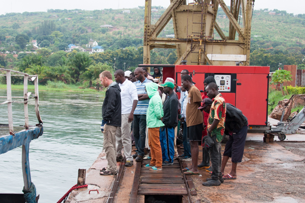
 

Will it float... anguish and anticipation of Peter

 
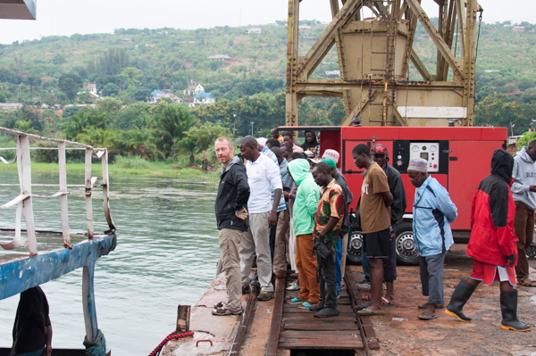
 

*Peter looks happy - is it floating!* 

 
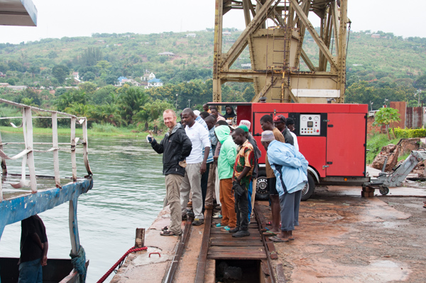
 

*Finally a thumbs up*

 
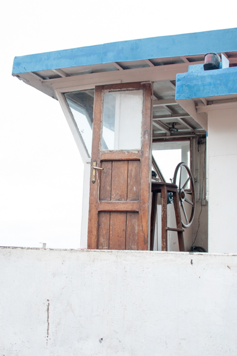
 

The captains chair... for tomorow

 
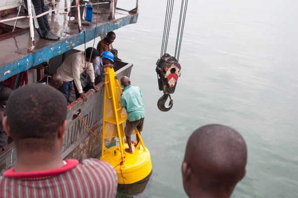
 

It floats well enough that you can stand on it to remove the hook.

 

 

Just have to move the ship around

 
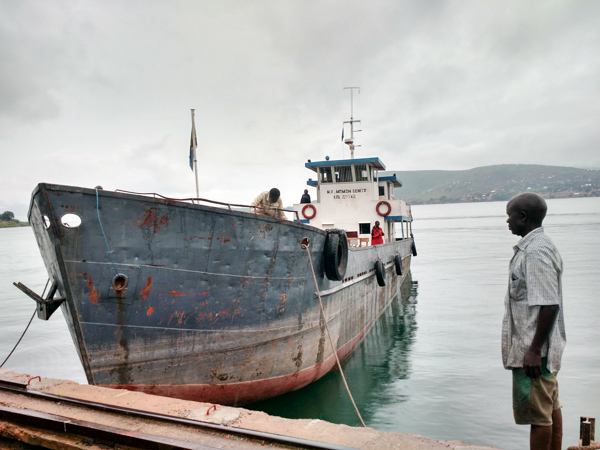
 

Time for the anchor...

 
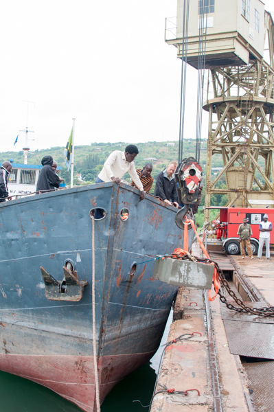
 

Time for the anchor...

 
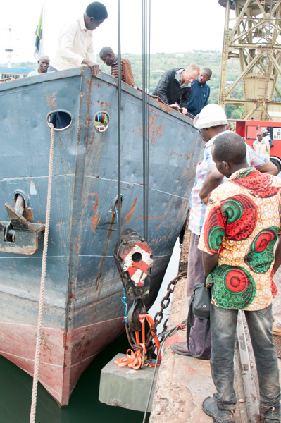
 

Time for the anchor...

 
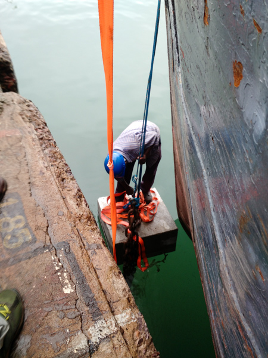
 

 
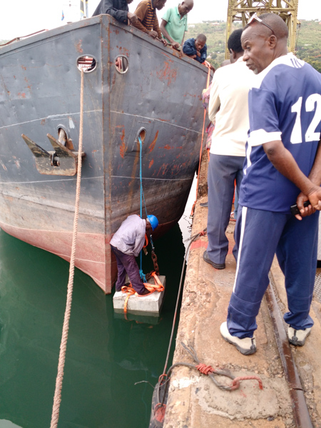
 

The engineer is removing the strap holding the anchor chain by standing on the anchor!!!

 
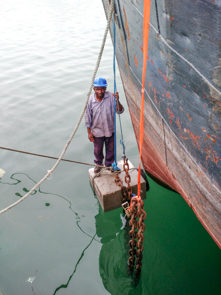
 

I wonder if they are going to let him off of that and back to shore!

 
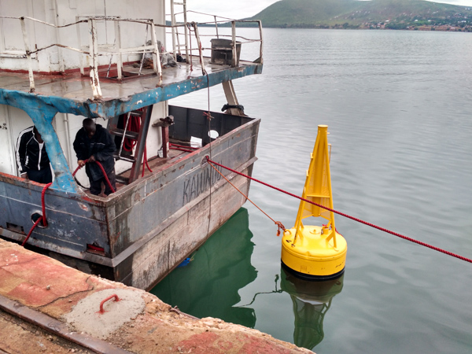
 

The anchor is still there and its time to head back to TAFIRI!

 
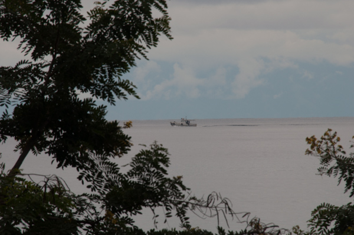
 

The TAFIRI ship the ECHO is heading out to survey the site with Ishmael and Catherine... 

 
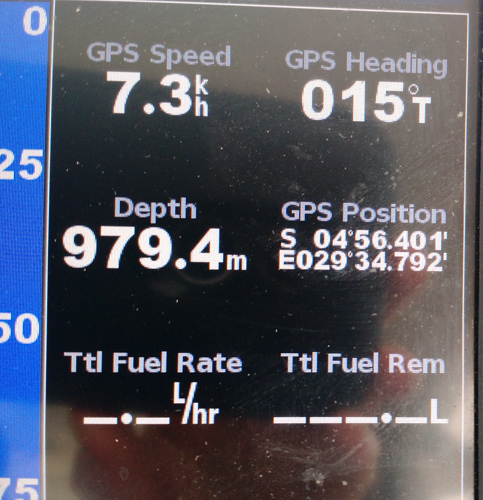
 

Surveying to find a place to put the buoy... we are going to need more cable Peter..... 

 
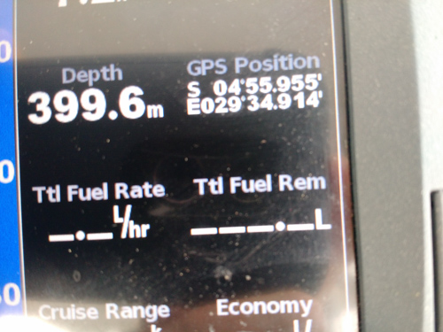
 

Ok this looks a little better... 

 
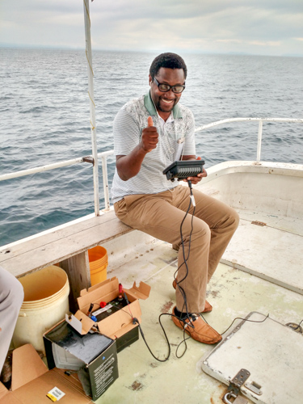
 

Ishmael gives it a thumbs up.... and they are off to port.

 
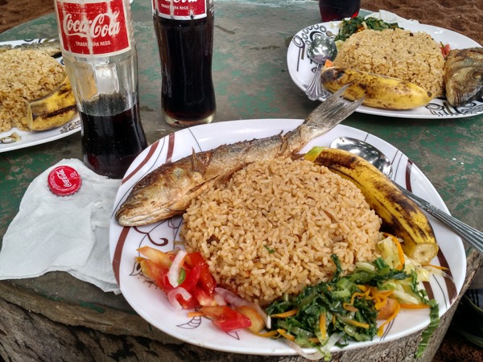
 

Time for lunch....

