---
output:
  html_document:
    css: perrycustom.css
---
## 2 December - Day 4 - TODAY IS THE DAY TO DEPLOY - One anchor down in 350 meters of water and the buoy is attached.

 
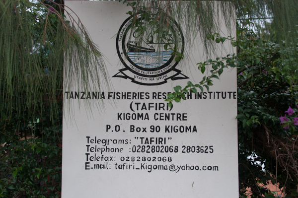
 

The Launch and all work starts at the TAFIRI Station

 
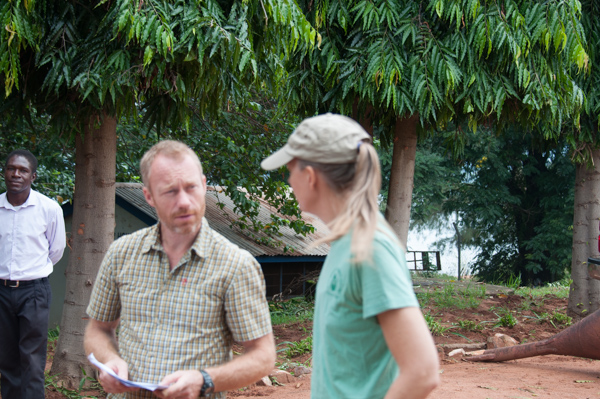
 

Discussion of the approach to launching the buoy.

 
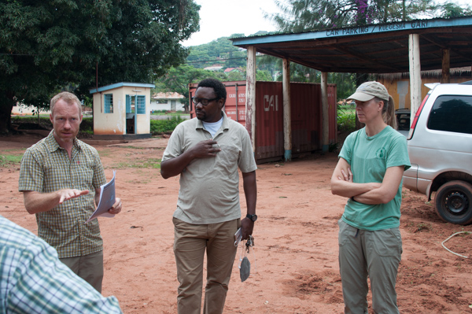
 

More discussions and working with Ishmael and the TAFIRI staff.

 
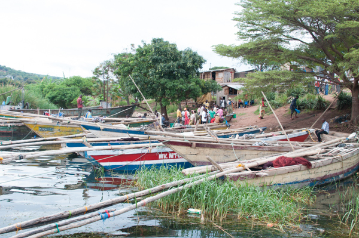
 

Just outside the Kigoma Port where the fishermen launch their boats. 

 
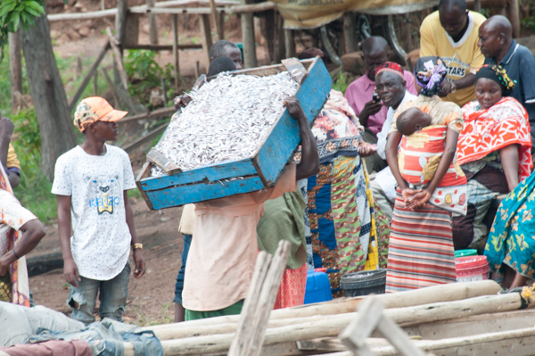
 

The fish harvest from the previous night. The fish are called dagaa locally and are taken ashore and dried.

 
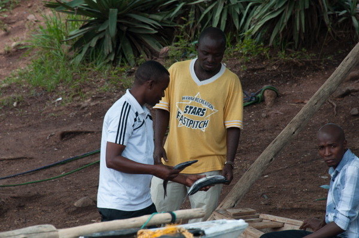
 

There are bigger fish as well - one of these was bought by our captain for dinner

 
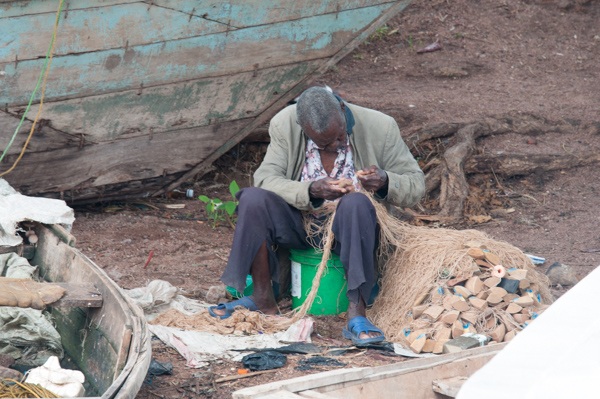
 

A fisherman repairing his nets at the fishing beach.

 
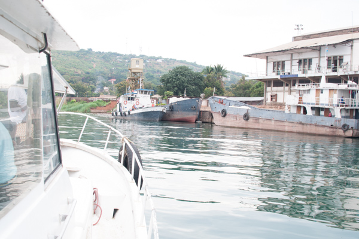
 

The RV Echo heads to the Maman Benita to check on the progress.

 
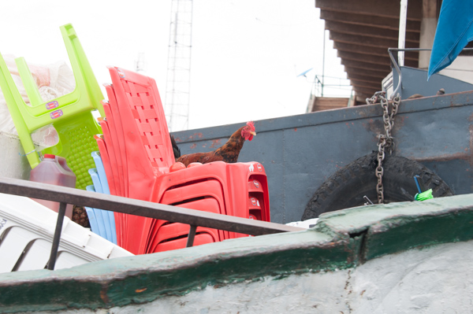
 

A ship moored next to the Maman Benita getting ready to transport goods. 

 
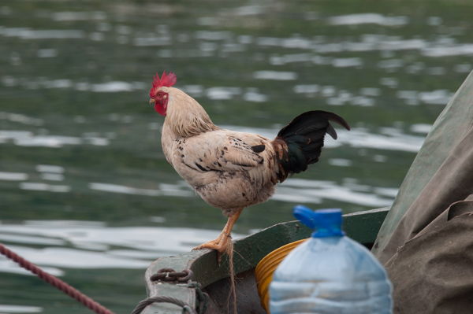
 

Chickens were enjoying the ride but will likely be dinner soon.

 
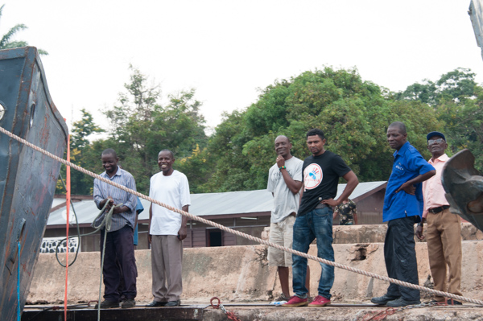
 

Looking at the anchor and getting ready to leave port.

 
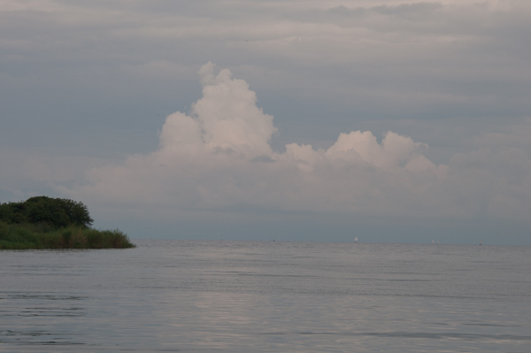
 

Cloudy and potential for storms that never came, which was great.

 
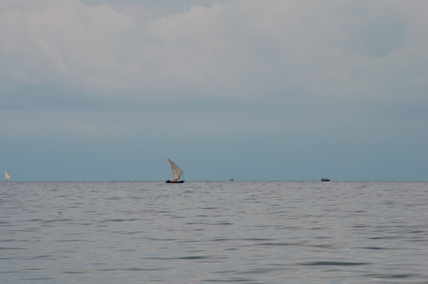
 

Boats fishing using wind power.

 
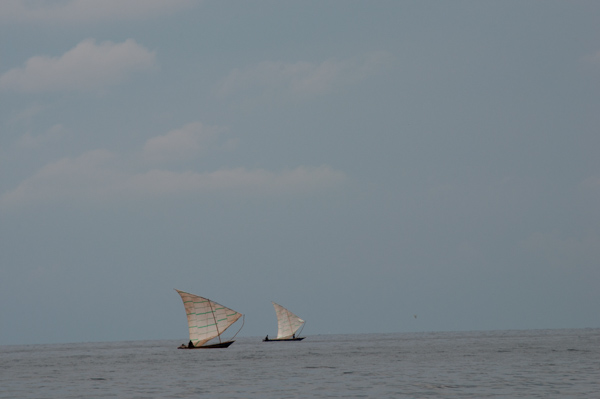
 

More sailboats

 
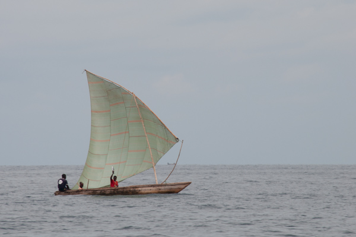
 

If you want to buy fish you can't get them any fresher - fisherman who I thought was waving was waving a fish.

 
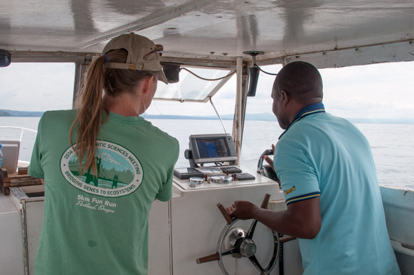
 

Trying to find the right depth and position.

 
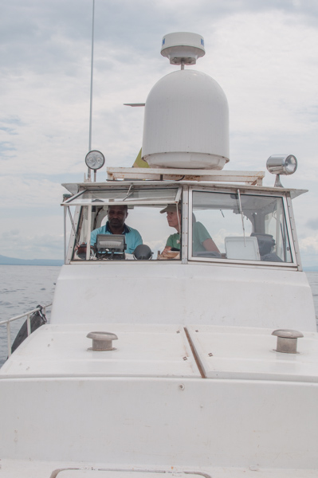
 

The captain, Edward, is very intent on getting the right location

 
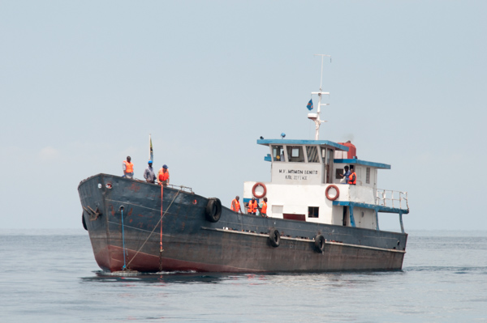
 

The Maman Benita arrives with all the gear in tow.

 
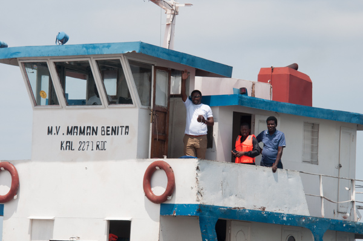
 

Ishmael working with the captain.

 
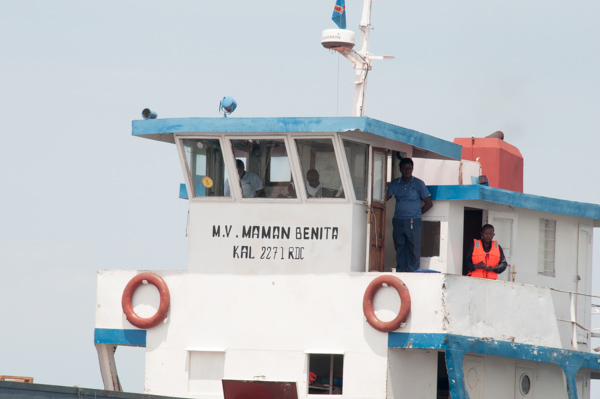
 

The captain and crew.

 
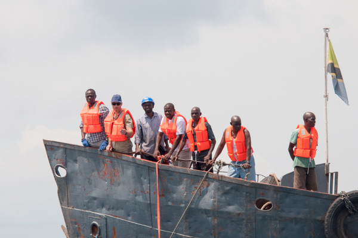
 

Peter looking over explaining how we will try to do this.

 
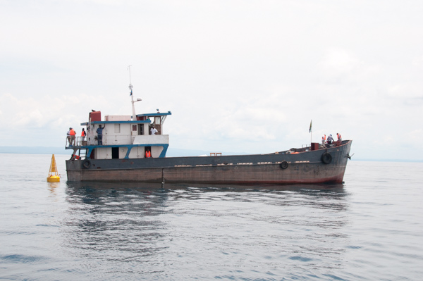
 

Preparing for the lowering of the anchor.

 
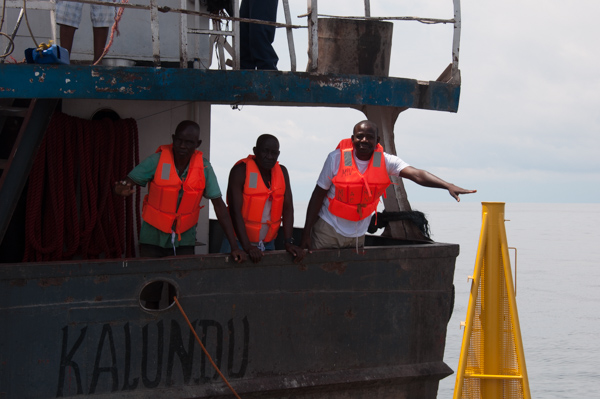
 

The buoy is rather large and was towed out to the site.

 
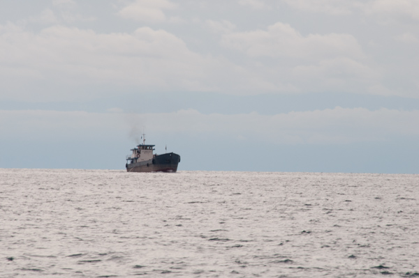
 

The speedy Echo is heading to port and the Maman Benita is also heading home.

 
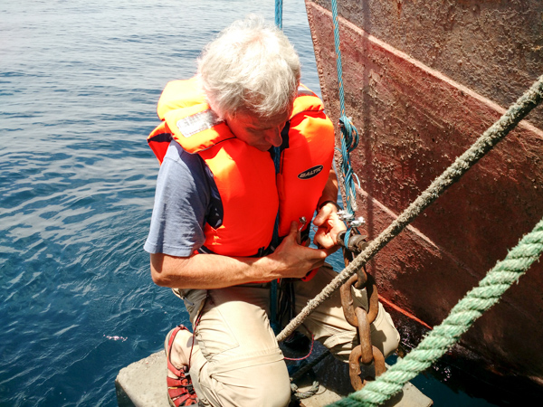
 

Removing the extra lines and bumper from the anchor before lowering the anchor.

 
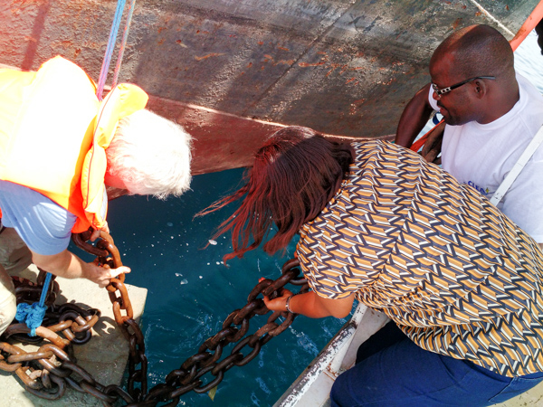
 

Trying to stack the anchor chain on the anchor and Prisca is helping..

 
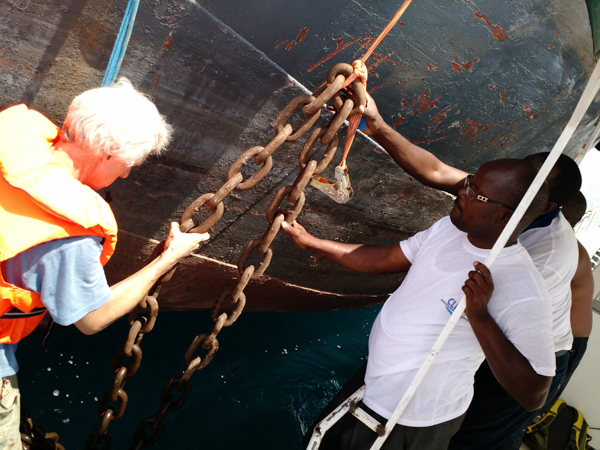
 

Moving the anchor chain still.

 
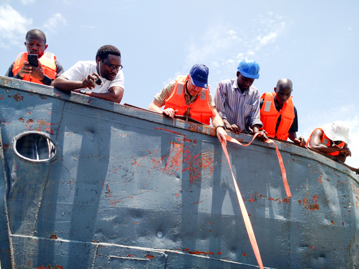
 

The crew is watching in anticipation.

 
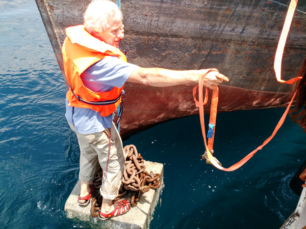
 

Ready to come back to the Echo.... Please!

 
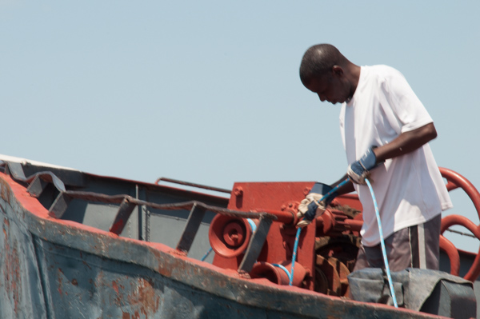
 

The captian lowering the 500 kg anchor

 
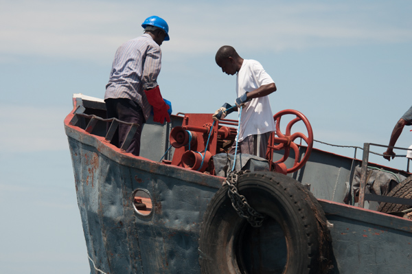
 

The captain and engineer looking at the winch and adding some oil to reduce friction.

 
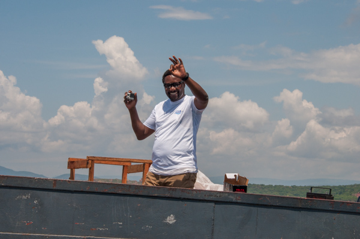
 

Ishmael capturing all the action on his camera.

 
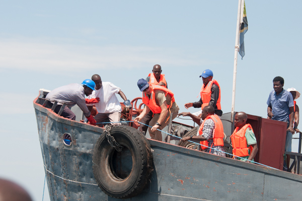
 

The oil reduced the friction too much and the cable came off of the winch - Peter was holding onto the cable.

 
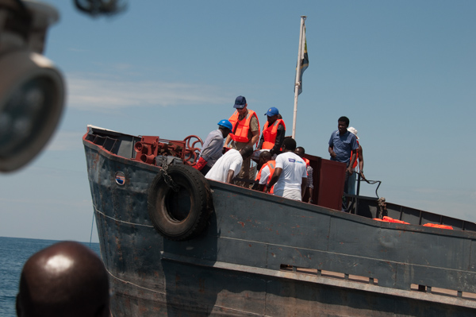
 

Luckily the cable dropped to 100m and the spool jammed on the stairs holding the anchor in place.

 
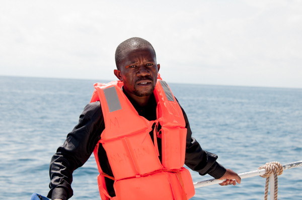
 

A crew member of the Maman Benita visiting the Echo.

 
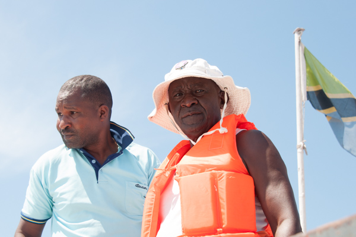
 

Edward, the captain of the Echo, and the cook of the Maman Benita looking around.

 
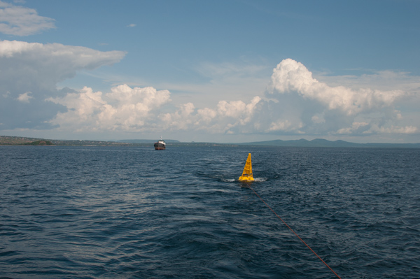
 

The Echo is now towing the buoy and pulling out cable from the Benita to do an uncontrolled release.

 
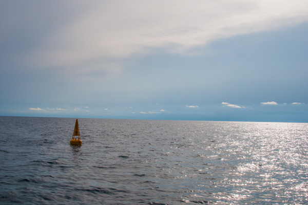
 

The buoy is now deployed in Lake Tanganyika.

 
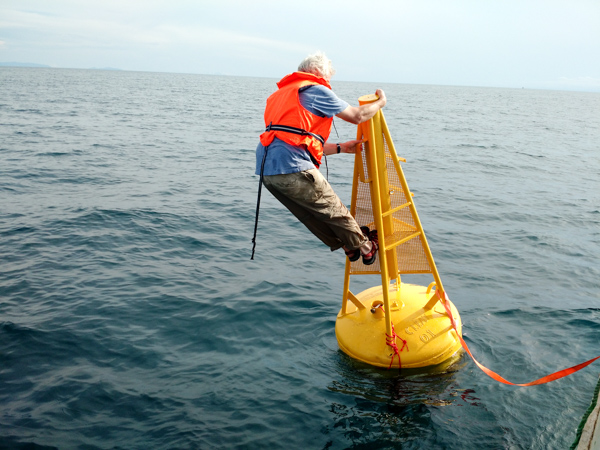
 

Having fun hanging on the buoy.

 
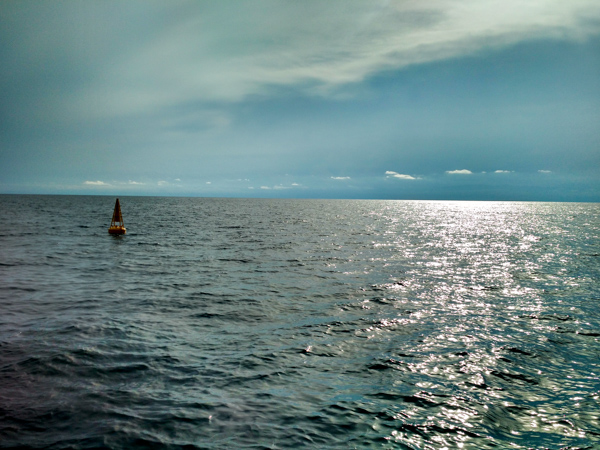
 

The final parting shot of the buoy until tomorrow.

