---
output:
  html_document:
    css: perrycustom.css
---
## 3 December - Day 5 - The last countdown - anchor 2 is deployed!!!

 
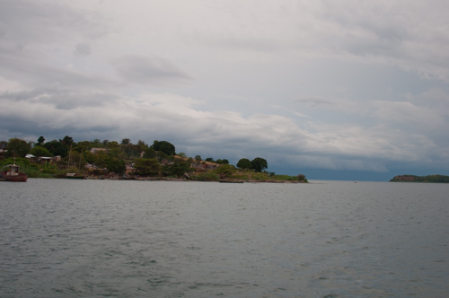
 

The launch of the second anchor is going to happen - the day is a bit less sunny and calm than the previous day.

 
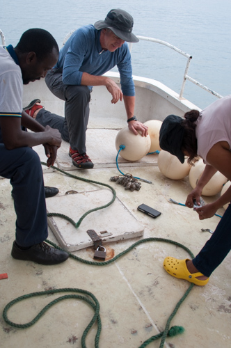
 

Preparing the anchor floats with Ibrahim and Prisca.

 
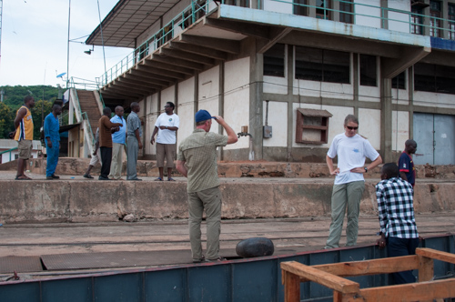
 

Trying to get the anchor attached to the side of the ship was a longer process than anticipated

 
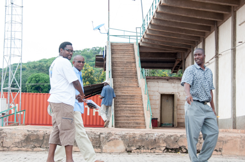
 

The owner of the ship is here for the last sail with the ship.

 
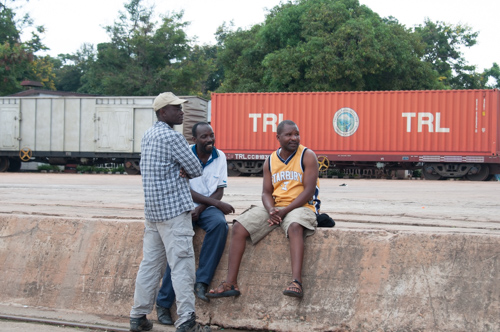
 

We are all standing around waiting to see what happens.

 
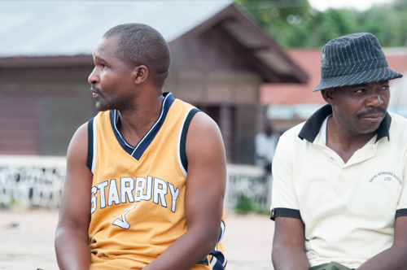
 

We seem to look both ways trying to figure out what to do next.

 
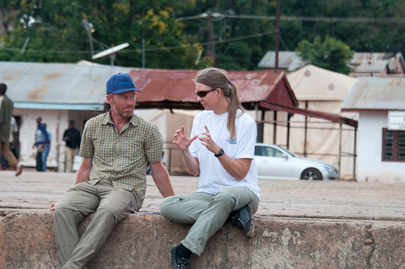
 

A bit of last minute planning with Catherine and Peter

 
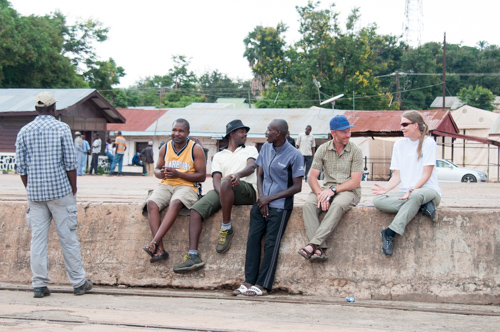
 

Just sitting on the dock of the bay - waiting to see if we can move the 500 kg anchor.

 
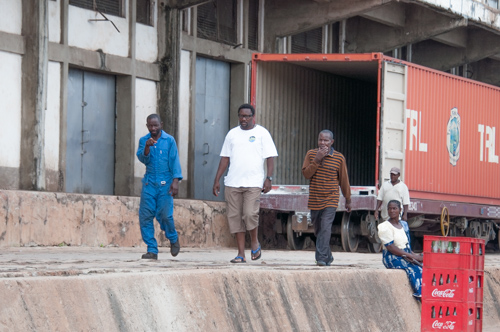
 

The engineer (Bernard), Ishmael, and the captain have a plan.

 
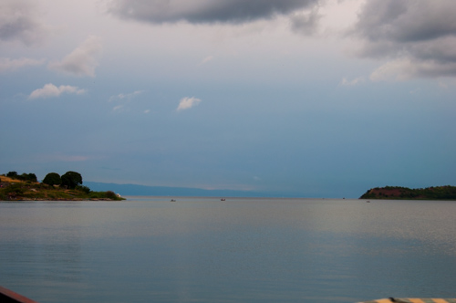
 

The weather is less and less inviting.

 
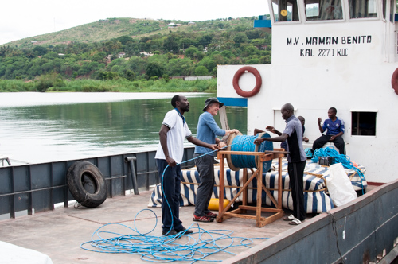
 

Might as well move the cable off the spool to get ready.

 
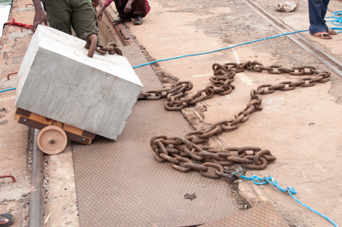
 

Preparing the anchor for the launch

 
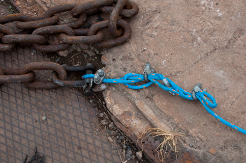
 

New cable clamps and a LOT of advice from the engineer - and we are ready to go but we have to move the anchor.

 
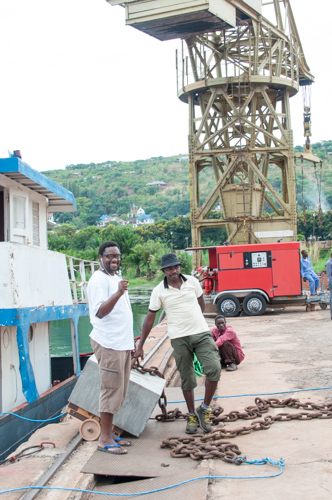
 

Ishmael and Sweki are always optimistic and it looks like we will try the crane in the background...

 
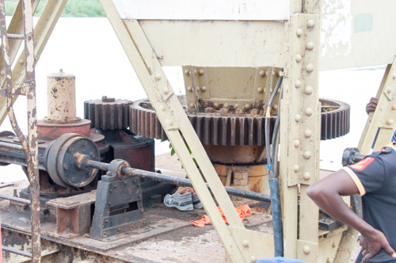
 

The crane has to be MANUALLY rotated using these gears

 
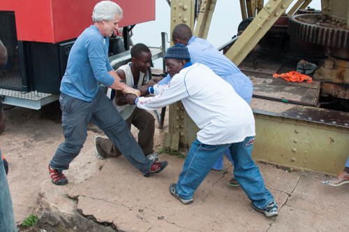
 

But it requires a bit of muscle

 
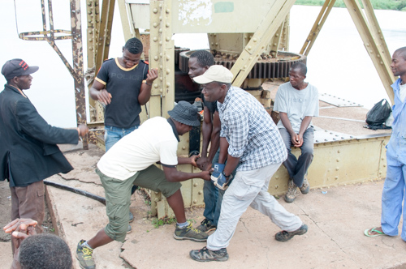
 

and maybe a bit more muscle

 
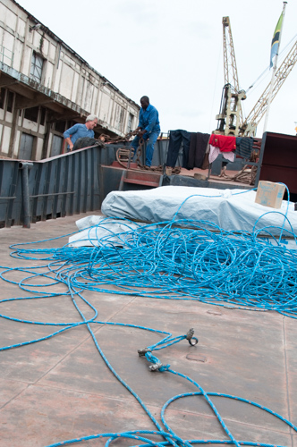
 

The cable is ready to go....

 
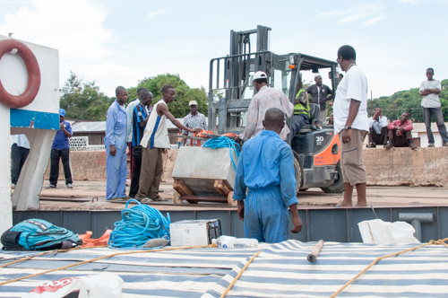
 

The forklift shows up about 3 - 4 hours later and moves the anchor to the other crane down the pier... 

 
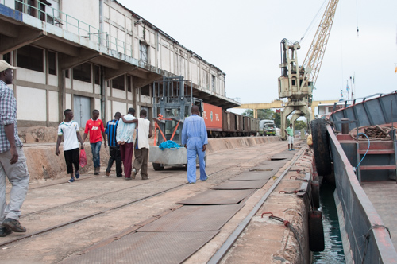
 

The anchor is on its way and so is the Echo

 
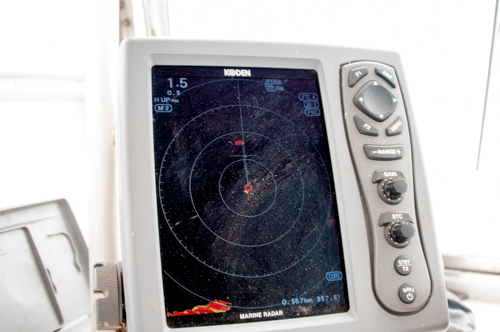
 

The buoy is so large that it shows up on radar

 
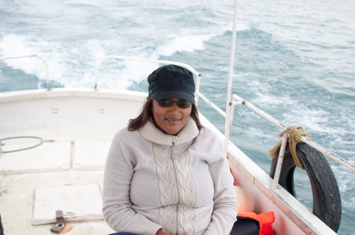
 

Prisca is ready to get this done and is always smiling....

 
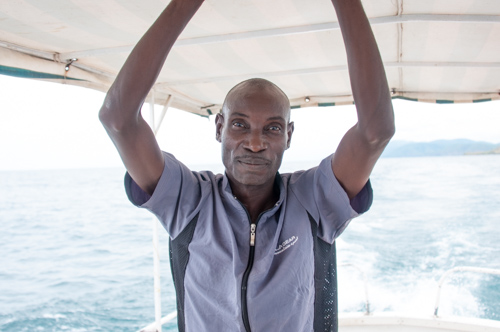
 

The deckhand of the Echo, a super nice guy

 
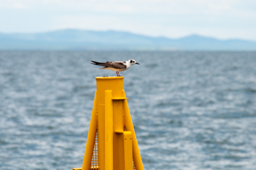
 

The birds like the buoy

 

 

Time for the birds to go and get some work done.

 
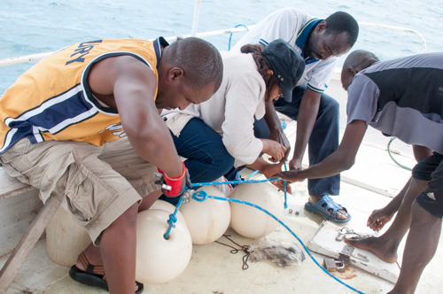
 

Everyone gets the anchor line floats ready 

 
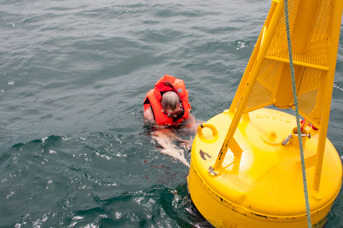
 

Time to add more cable clamps to the buoy. The water was nice and calm at this point - only 0.3 m swells.

 
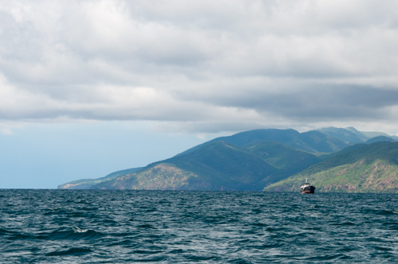
 

The anchor is on its way.

 
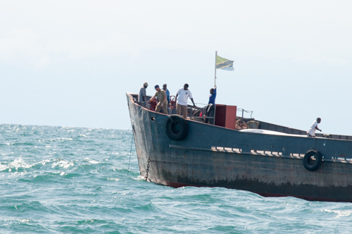
 

Getting ready to cut the final ropes to release the anchor.  
 
 
 
 
 
 
 
*The attachment of the second anchor line was a bit stressful so there are no photos of that.*

 
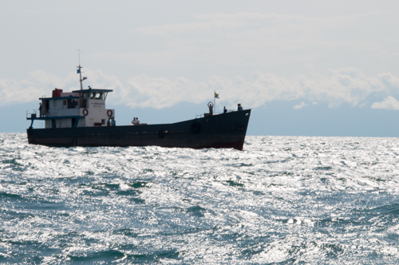
 

Success and we are off

 
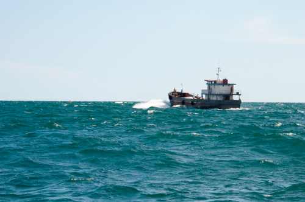
 

The Maman Benita heads back to look at the buoy and then home.

 
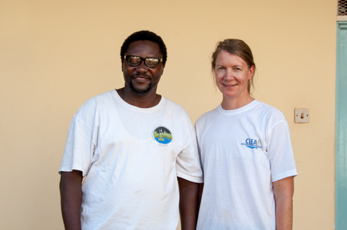
 

Ishmael and Catherine showing off thier GLEON and CLEAT shirts - Front

 
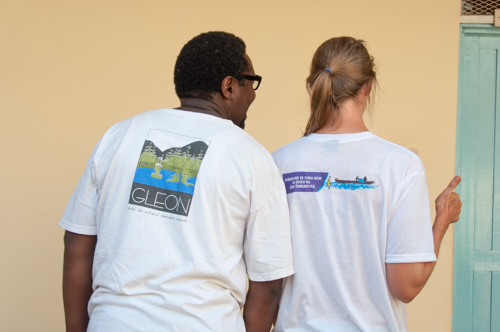
 

and back

 
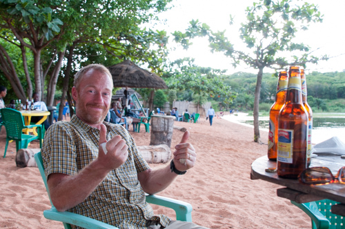
 

Time to relax... Peter is happy....

 
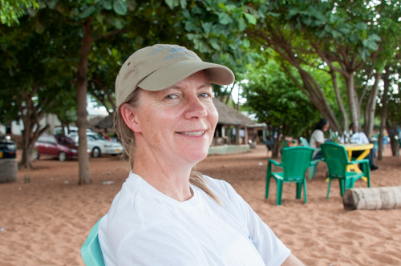
 

Catherine is happy..

 
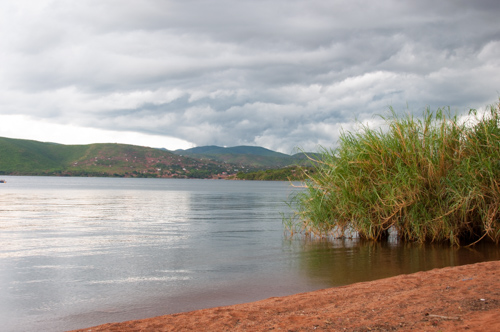
 

The rain starts to roll in..

 
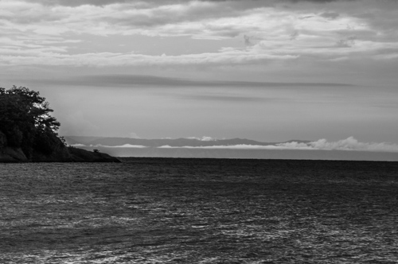
 

Time to stop....

