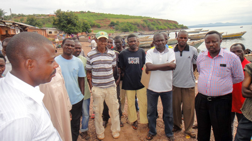
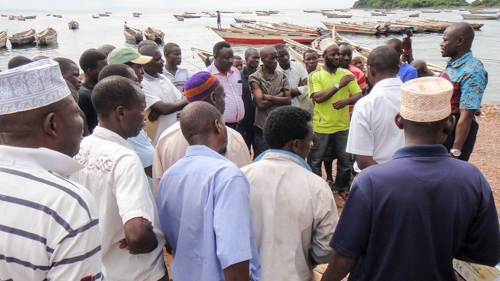
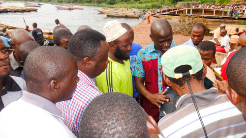
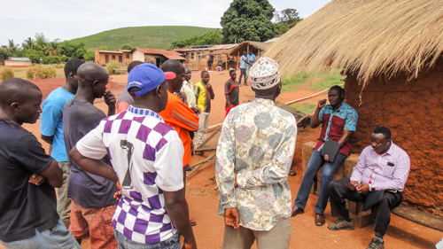
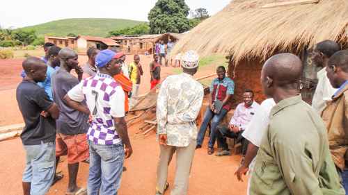
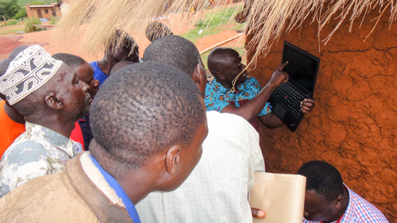

---
output:
  html_document:
    css: perrycustom.css
---
## 5 December - Day 7 - Huruma and Sweki head to the local fishing beaches where fishermen are preparing to go out again tonight.

All of these photos were taken by TAFIRI people as they talked to the fishermen.

 

 

Huruma showing the fishermen images of the buoy on his computer.

 

 

Discussing the buoy and what it provides to the fishermen. There will be an app/webpage developed by Rishi Saripalle and Jonathan Mitchell in the School of Information Technology at Illinois State University. Jonathan is an undergraduate there and was able to make the app in only a month or so, in both Swahili and English.
 

 

Huruma showing more images to fishermen.
 

 

Time for another fishermen's beach and more discussion.
 

 

Huruma answering questions.

 

 

A bit of shade and a laptop is great for showing the second village images of the new buoy.
