---
output:
  html_document:
    css: perrycustom.css
---
## 5 December - Day 7 - Time to put sensors on the buoy.

###This time we had the help of a new person to take photos. Amani was responsible for most of the photos in this page.

 
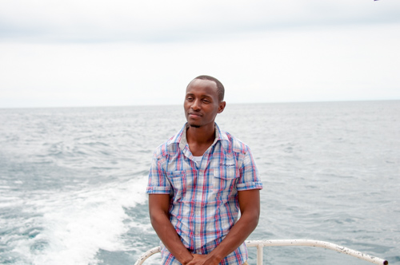
 

Amani is the one that took almost all the photos and is also the computer person at TAFIRI.

 
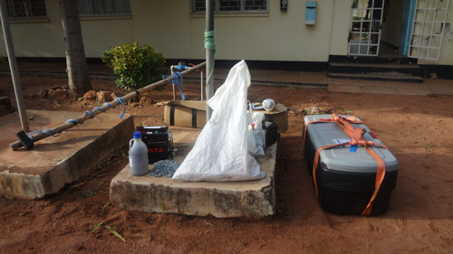
 

All the materials are ready to go - time to get out before the winds start to build. By afternoon the swells might be up to 0.7 m or larger again.

 
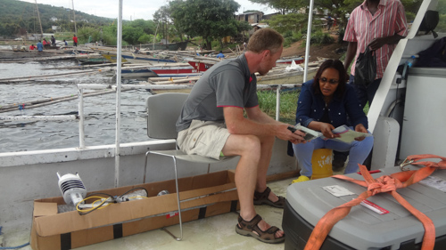
 

Prisca and Peter discuss the plans at the fishermen beach in Kigoma.

 
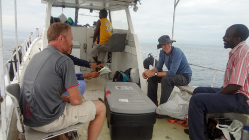
 

Prisca and Peter explain it to the rest of the crew.

 
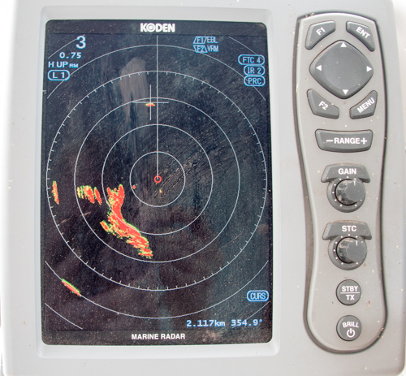
 

The buoy on radar. Hopefully other ships see it and don't run over it.

 
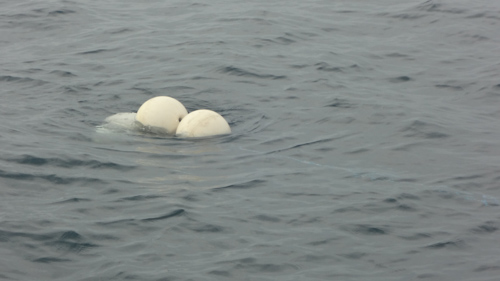
 

The anchor floats are still on the surface and we will try to sink them down a bit tomorrow.

 
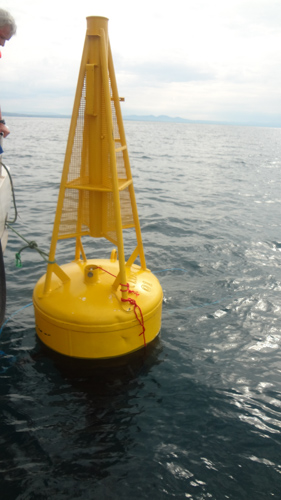
 

The buoy is a bit bare but that will change. The lake is perfect for doing this work.

 
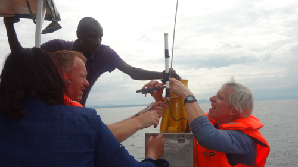
 

It takes 4 - Prisca, Peter, Kodio (spelling is likley wrong - sorry), and Bill put on the lightening rod, and below that the data logger is already on, in the metal box.

 
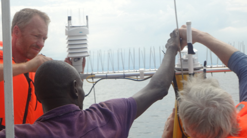
 

It is not for the birds, the wind, rain, humidity and temperature sensor are all on and ready to go.

 
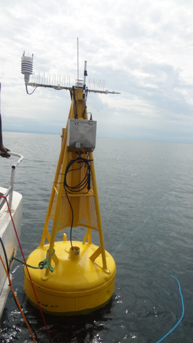
 

The buoy looks a bit different now - you can just see the sensor chain being lowered.

 
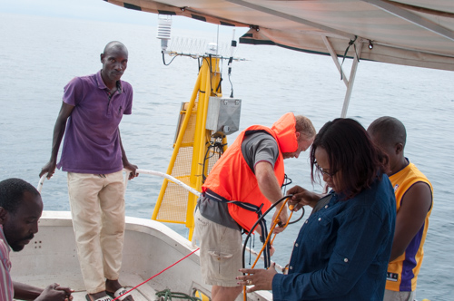
 

Lowering 150 m of sensors into the lake... only doing the shallow layers of the lake.

 
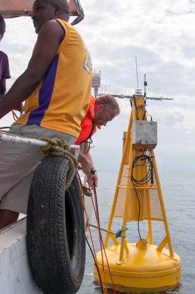
 

Peter lowering the sensor chain.

 
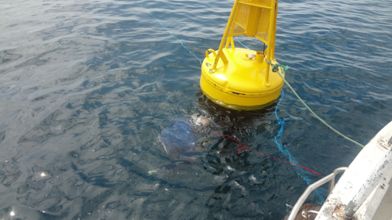
 

Time for some last minute attachments underwater of the cable to the buoy for grounding.

 
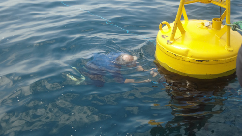
 

Time to check the attachments

 
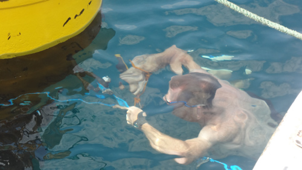
 

Peter trying to hammer underwater to tighten the anchor attachments.

 
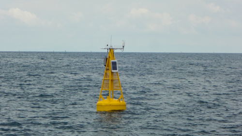
 

The buoy in its glory.

 
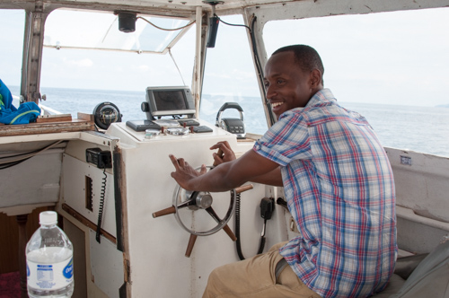
 

I think Amani wants to be captain of the boat!

 
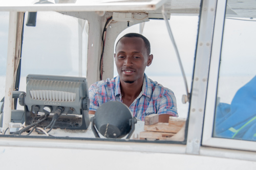
 

I dont think the captain, Edward, is going to be happy....

 
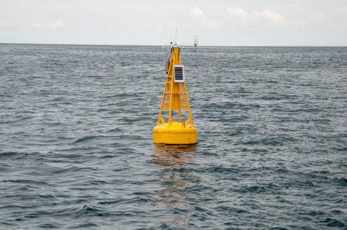
 

Time to leave and let the technology do the work.

