---
output:
  pdf_document: default
  html_document:
    css: perrycustom.css
---
## 7 December - Day 9 - The ribbon cutting out on Lake Tanganyika.

###The entire group headed out on the Echo and the Maman Benita to unveil the buoy. I do not know many of these people and will describe the situation and will be very brief.      

 
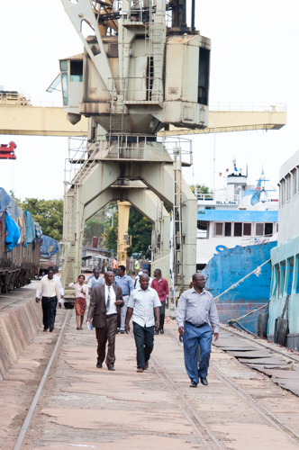
 

The guests start to arrive at the Maman Benita.

 
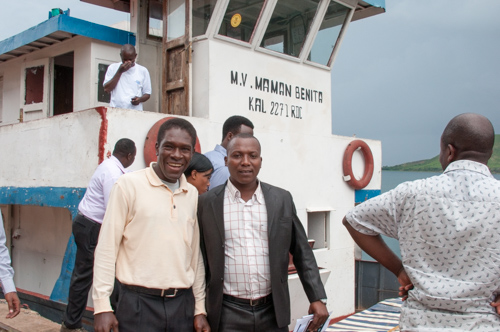
 

Everyone is happy to go on the boat.

 
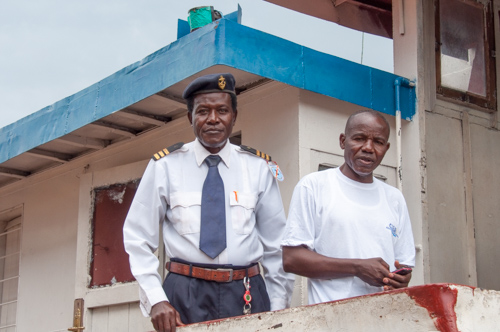
 

The crew are dressed in their finest and also in the CLEAT project t shirts.

 
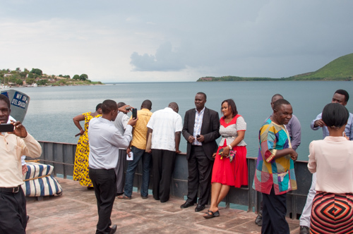
 

More photos and a bit of weather in the background.

 
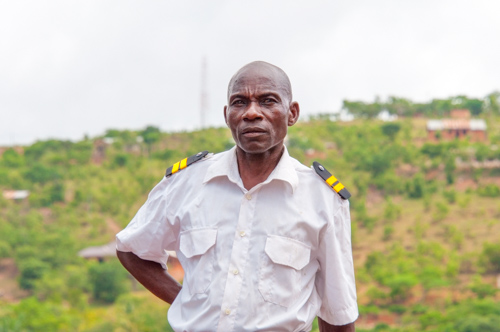
 

More crew.

 
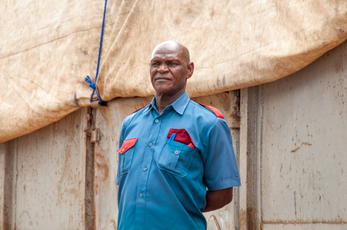
 

The guard that allowed us access to the pier.

 
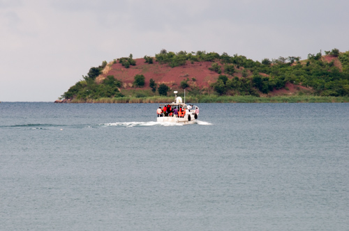
 

The Echo is off with all of the dignitaries

 
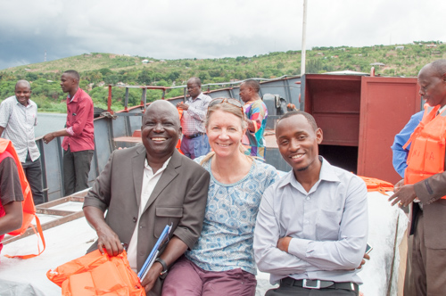
 

Everyone is happy that the buoy is in and the rest of the day is a on the boat.

 
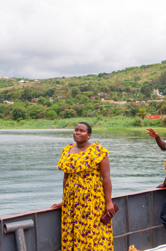
 

This elegant lady had the greates colored dress I have seen in years.

 
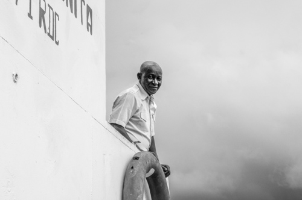
 

The crew worked so hard - they were truly amazing.

 
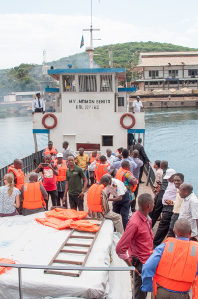
 

I don't think the Maman Benita has seen so many people on its deck in a while

 
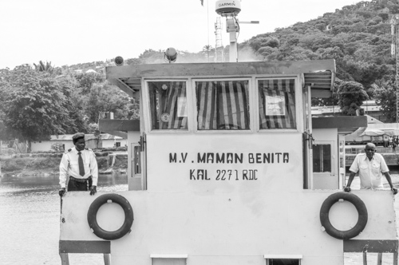
 

More crew

 
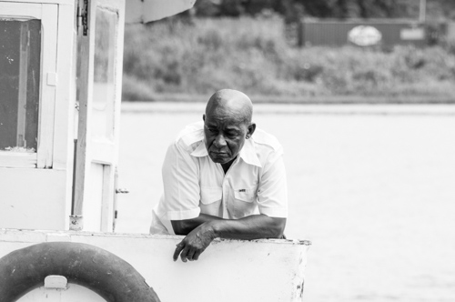
 

The cook!

 
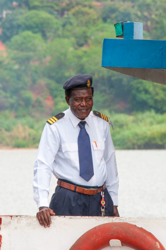
 

One of the best dressed.

 

 

Just lounging in the sun

 
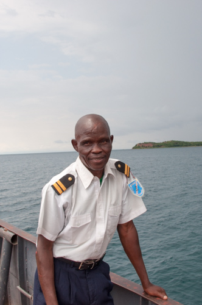
 

I could not thank the crew enough for all of their work.

 
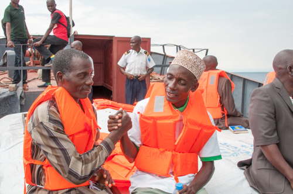
 

The fishermen were a pleasure to have on board - they are one of the big reasons we are doing this project.

 
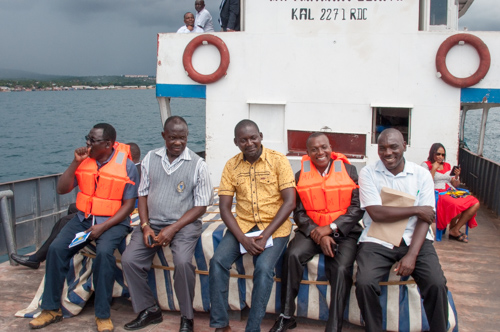
 

More people

 
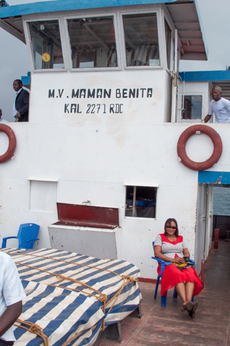
 

I think Prisca needs a break.

 
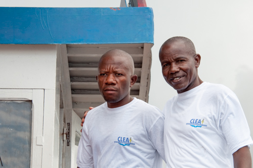
 

The crew in CLEAT  t shirts

 
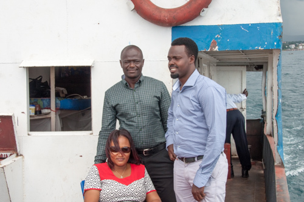
 

The students of TAFIRI!

 
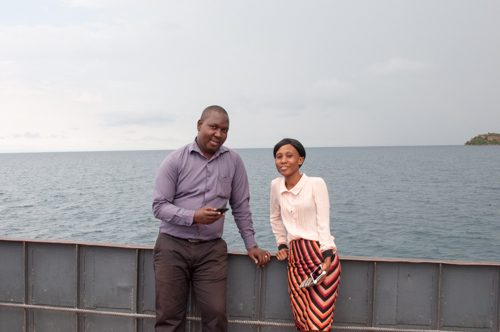
 

Everyone was really happy.

 
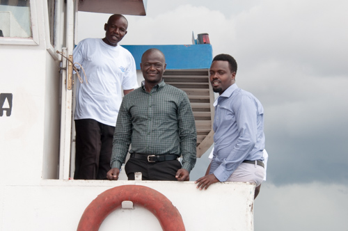
 

I would say they are relaxed and ready to get to work - tomorrow

 
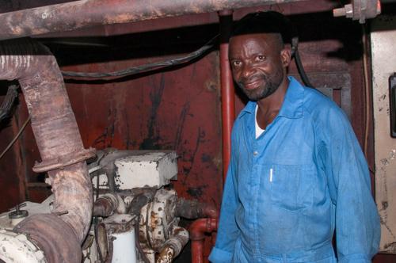
 

The engineer Bernard - he keeps this ship running down in the engine room

 
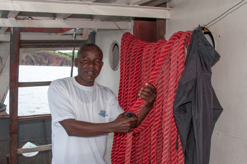
 

More crew

 
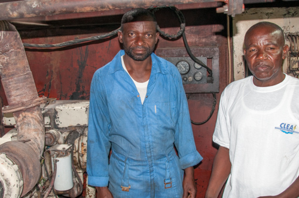
 

The engineer Bernard and one of the Captains. 

 
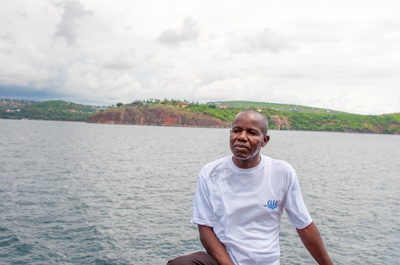
 

Crew were having a great time with everyone and enjoying a bit of time off.

 
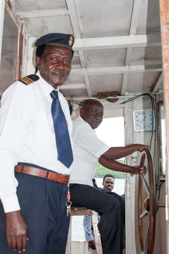
 

Crew were having a great time with everyone and enjoying a bit of time off.

 
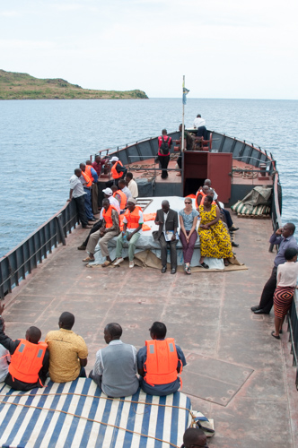
 

It takes about 45 minutes to get to the Buoy from port

 
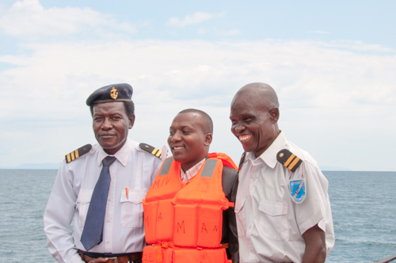
 

This was the best dressed crew on Lake Tanganyika.

 
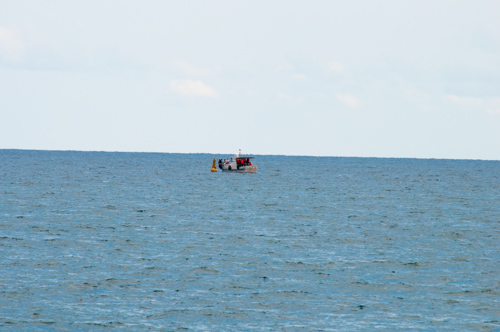
 

The Echo is at the buoy

 
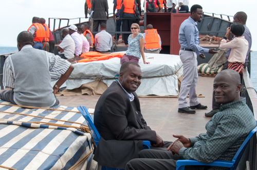
 

Talking fish!

 
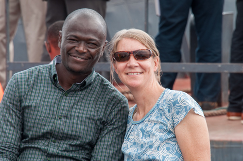
 

Catherine and Huruma.

 
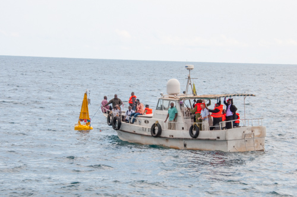
 

The Echo moored to the buoy for the ribbon cutting

 
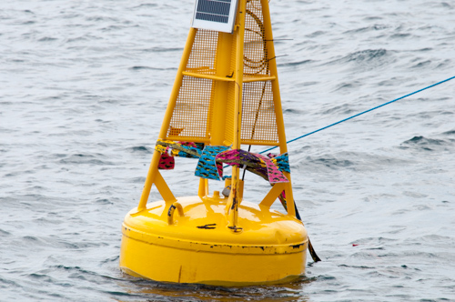
 

The ribbon around the buoy

 
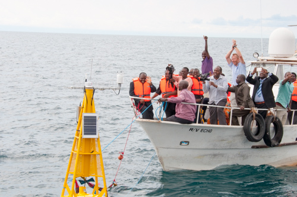
 

The regional director ready to pull the ribbon

 
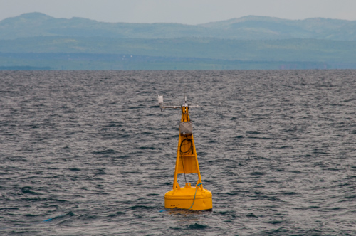
 

The buoy is officially on site and ready to do its job.

 
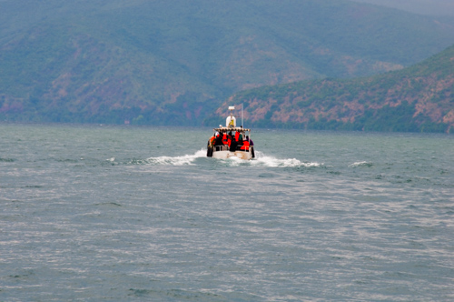
 

The Echo heads home

 
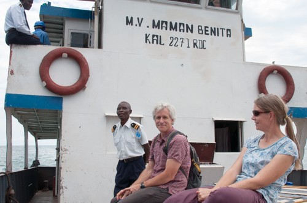
 

I may have more updates as we finish some of the work on the buoy. Thanks for watching - Willy

