---
output:
  html_document:
    css: perrycustom.css
  pdf_document: default
  word_document: default
---
## 7 December - Day 9 - 'Official Buoy Launch Event'. Meeting as TAFIRI Kigoma to talk about the policy and science going on in and around Lake Tanganyika.      

###A great group of people gave presentations on the policy and science as it pertained to Lake Tanganyika.      

 
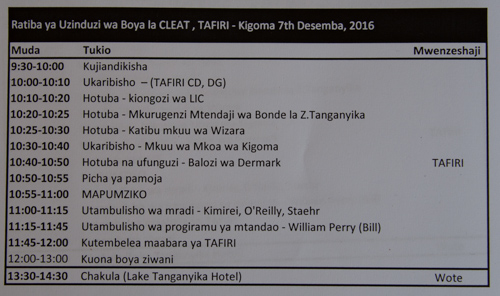
 

The plan for the day

 
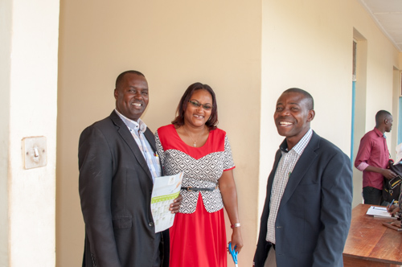
 

The guests start to arrive and are met by Seki and Prisca. 

 
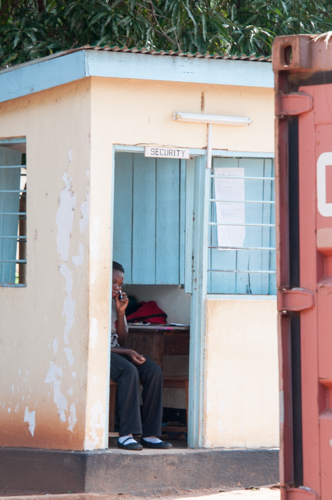
 

The gate guard is waiting for everyone.

 
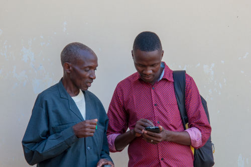
 

I believe these are fishermen representing the Beach Management Units that deal with the fisheries at a local level.

 
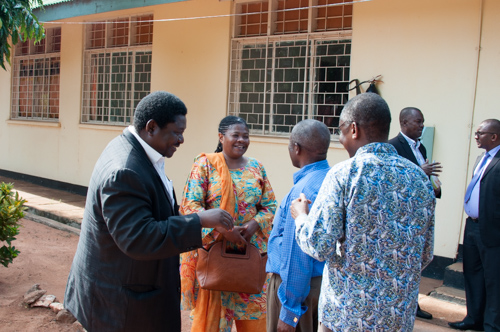
 

More guests arrive

 
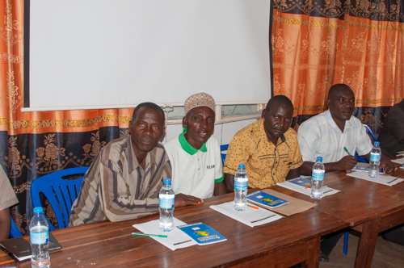
 

Local Beach Management Unit fishermen are at the back of the room.

 
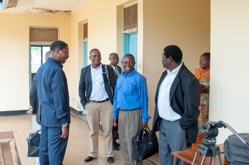
 

More guests.

 
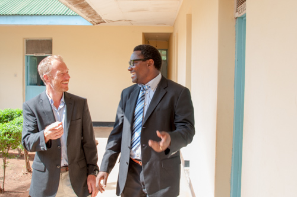
 

I think Peter and Ishmael are really happy now that everything is set.

 
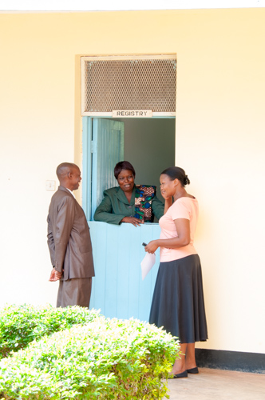
 

Tafiri staff are having a great time.

 
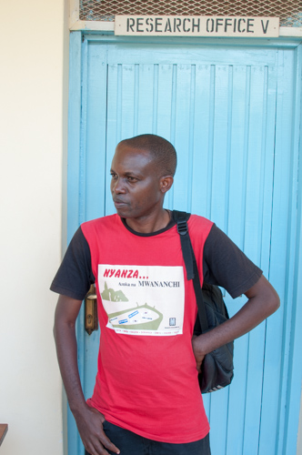
 

The shirt is very interesting and talks about community and science.

 
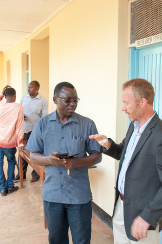
 

More guests.

 
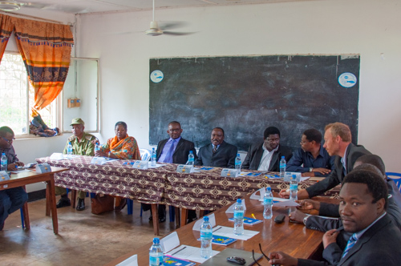
 

Some of the guests of honor... the administrators.

 
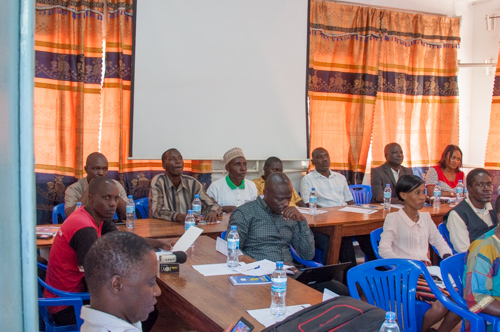
 

More of the guests of honor.... the fishermen and others.

 
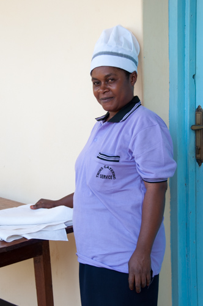
 

The catering company - they had great food.

 
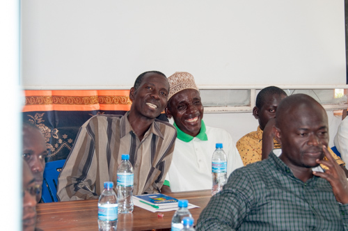
 

The fishermen are having a GREAT time.

 
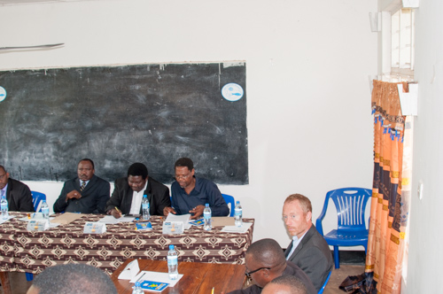
 

The dignitaries.

 
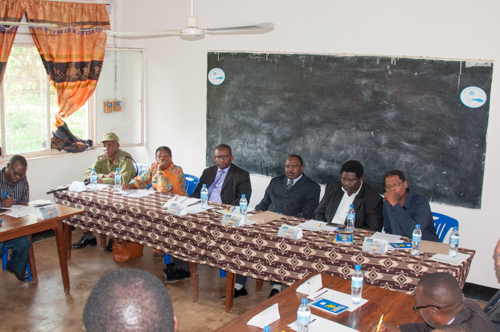
 

More of the dignitaries.

 
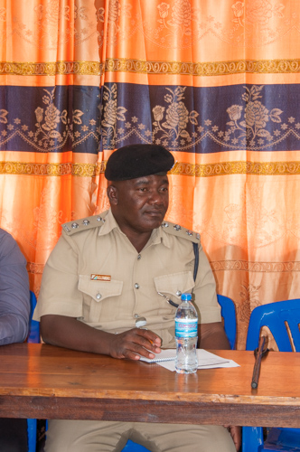
 

Many men in uniforms.

 
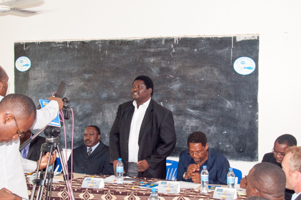
 

Speeches...

 
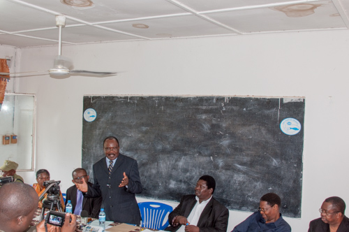
 

The regional commisioner gives his speech and was very eloquent.

 

 

The regional commisioner gives his speech and was very eloquent.

 
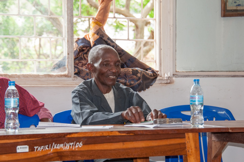
 

This man was really enjoying the speeches.

 
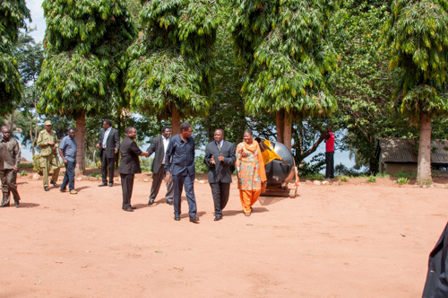
 

Heading out for a group photo and tour of TAFIRI at Kigoma

 
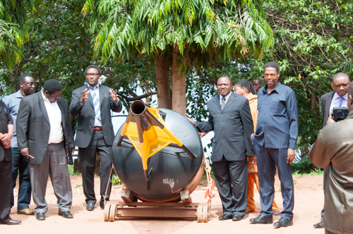
 

The group photo begins around the extra donated buoy.. . 

 

 

The group photo, gradually people are coming. . . . 

 
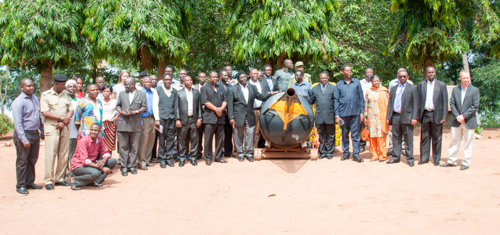
 

The group photo 

 
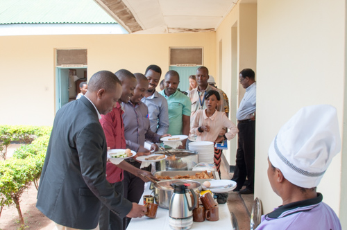
 

Time for tea and snacks before some of the science talks.

 
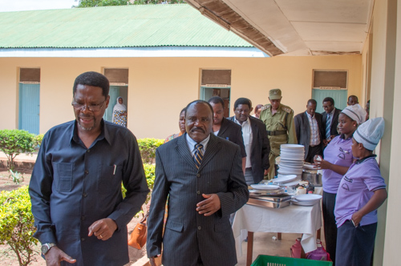
 

Gathering for the rest fo the talks.

 
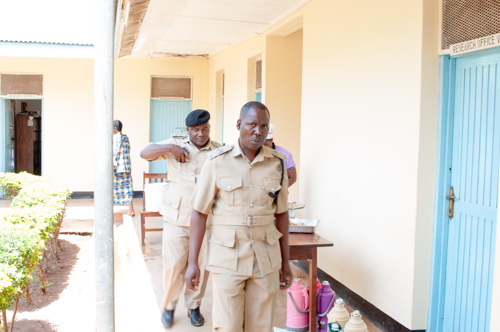
 

The men in uniforms are on their way back in.

 
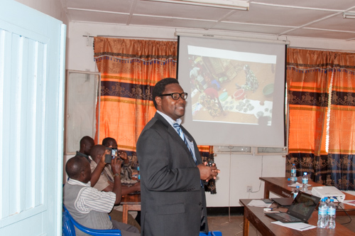
 

Ishmael talks about the current state of the fishery and the need for more science.

 
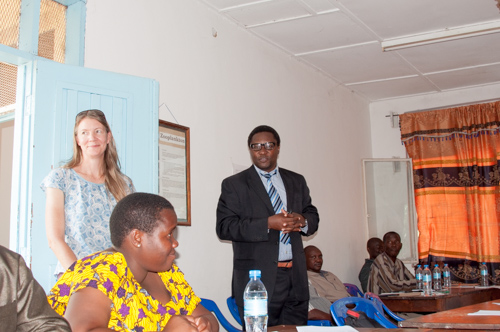
 

Ishmael introduces Catherine O'Reilly whose research on the role of climate change in affecting the local fishery was a key insight into a potential reason for the declining fishery. Now for more research.

 
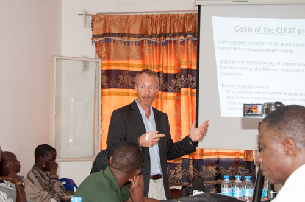
 

Peter give a great introduction to the research.

 
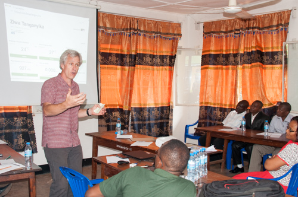
 

Bill talks a bit about the data and the web page.

 
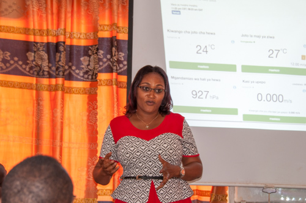
 

Prisca presents a great introduction to what we can do with the data.

 
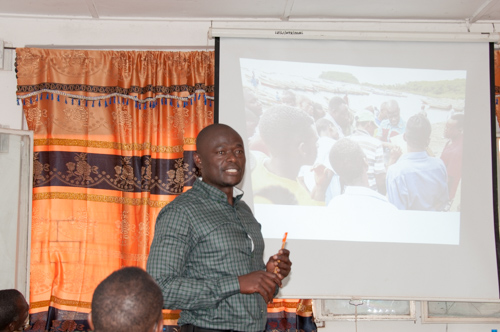
 

Huruma talks about what it means for the fishery.

 
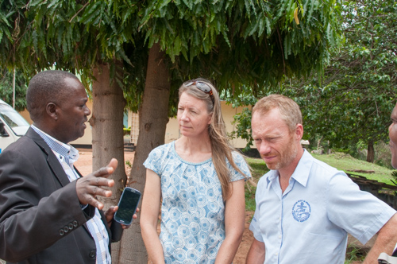
 

A few discussions about a buoy for Bujumbura.

 
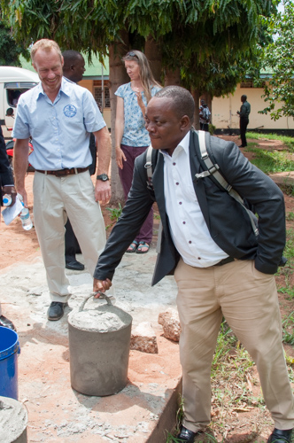
 

Dr. Charles Lugomela from Univeristy of Dar es Salaam shows us how we should have moved the anchors... he can lift these cement blocks with one finger.

