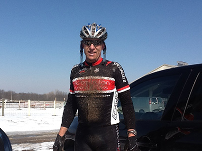
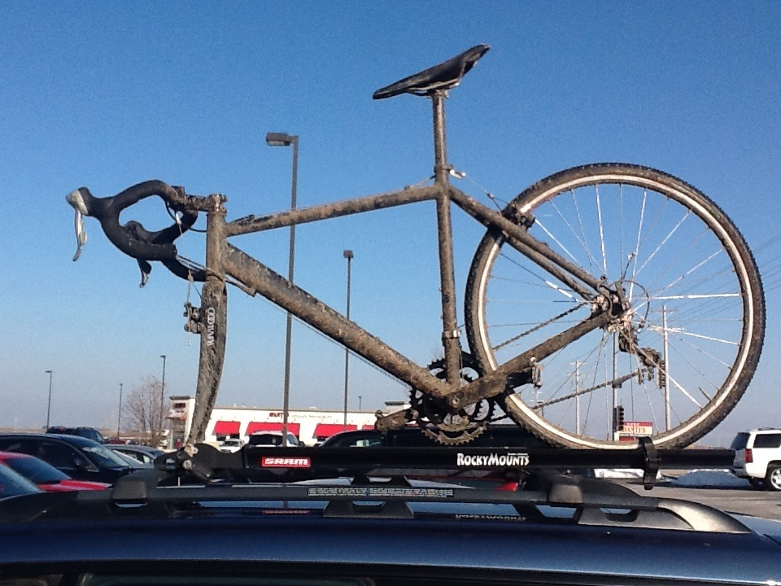

---
title: "Fun Stuff"
output:
  html_document:
    css: perrycustom.css
---
      
## This will be fun stuff eventually      
     

This is what I look like when I have had some fun.    
     

## This is what the bike looks like      

<!-- Global Site Tag (gtag.js) - Google Analytics -->

