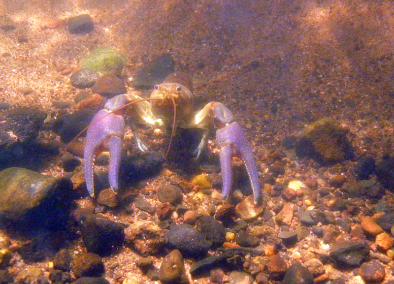
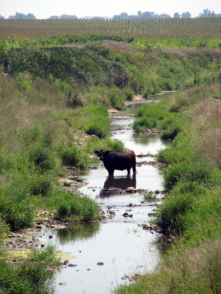

###Welcome to my new webpage made in R. 

#### Crayfish ecology
  One of my passions is invasive species ecology with a focus on crayfish. We are currently focusing on the invasions dynamics of the rusty crayfish, *Orconectes rusticus*, in streams. We are assessing the role of flow as a force mediating invasion speed and success. Another aspect of this research is examining the role of hybridization in streams using microsatellite markers we are still working on developing.

-------------

#### Effects of watershed management on stream water quality
This project is examining the effect of implemented best management practices on water quality in an experiment stream versus a reference stream.  We are currently working with The Nature Conservancy to examine the effects of watershed management practices and wetlands on downstream water quality. This work is being conducted in headwater streams of the Mackinaw River east of Illinois State University. We are also working on several other projects dealing with long term data and cover crops in agricultural streams.

------

#### Role of cover crops in reducing nitrate loss to receiving streams

--------

#### Monitoring of water quality entering Lake Bloomington and Lake Evergreen for the City of Bloomington.

