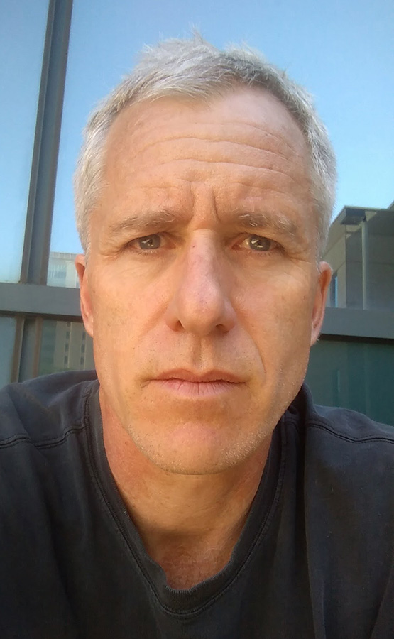

# Welcome to my webpage!

{.wrap-right fig-align="right" width="255"}

::: {.announcement-box .opportunities}
<h3>🎓 Graduate Opportunities Available at UM-Duluth!</h3>

<strong>I am actively seeking graduate students</strong> interested in:

<ul>

<li><strong>Urban stream ecology</strong></li>

<li><strong>Rusty crayfish invasion dynamics</strong></li>

<li><strong>Stream biological research</strong></li>

<li><strong>Other aquatic ecology projects</strong></li>

</ul>

<strong>Funding available:</strong> I have support for graduate research assistantships and summer RA positions. If you're interested in joining my lab, please reach out!

:::

------------------------------------------------------------------------

## New Projects Being Developed at UMD

::::::: project-section
<h3>Current Research Focus Areas</h3>

My new laboratory at the University of Minnesota Duluth is developing exciting research programs in:

::: highlight-box
<strong>🏙️ Urban Stream Ecology</strong> - Investigating how urbanization affects stream ecosystems and water quality
:::

::: highlight-box
<strong>🦀 Invasion Biology</strong> - Continuing work on rusty crayfish and other invasive species dynamics
:::

::: highlight-box
<strong>🐟 Lamprey Population Dynamics</strong> - New research on native lamprey species in Great Lakes tributaries
:::

::: highlight-box
<strong>🌊 General Stream Ecology</strong> - Broad ecosystem studies of northern Minnesota waterways
:::
:::::::

------------------------------------------------------------------------

<h2 class="section-header">

Previous Research at Illinois State University

</h2>

::: project-section
<h3>Past Laboratory Research Areas</h3>

The work conducted in my previous laboratory covered two broad areas of research:

**1. Biogeochemistry of streams, lakes, and tile-drained agricultural fields**

- Watershed management effects on stream water quality
- Nitrate removal of constructed wetlands\
- Cover crop reduction of nitrate losses
- Monitoring water quality in streams entering two drinking water reservoirs

**2. Crayfish ecology and invasions**

- Invasion dynamics in streams
- Performance and behavior in flow
- Morphological differences in response to flow

<h4>Recent Illinois State Project:</h4>

**Role of cover crops in reducing nutrient loss** from a new experimental plot system using a new cash cover crop. The aspects of this project included:

- Soil quality and nutrient content
- Porewater nitrogen concentrations with and without cover crops
- Weed diversity and biomass associated with cover crops compared to reference
- Honeybee use of the cover crop
- Nutrient loss from tile water
:::

------------------------------------------------------------------------

::: {.announcement-box .full-width}
<h3>📧 Interested in joining my research group?</h3>

I encourage prospective graduate students to reach out via email to discuss research opportunities, funding options, and application processes. I'm particularly excited to work with students who are passionate about aquatic ecology and environmental science.

<strong>Background preferred:</strong> Students with a background in ecology and preferably with aquatic ecology experience.

<strong>Please include with your inquiry:</strong>

<ul>

<li>Curriculum vitae or resume</li>

<li>Unofficial transcript or list of classes and GPA</li>

<li>Brief description of your research interests</li>

</ul>

<strong>Contact:</strong> <a href="mailto:wlperry@d.umn.edu">wlperry\@d.umn.edu</a>

:::